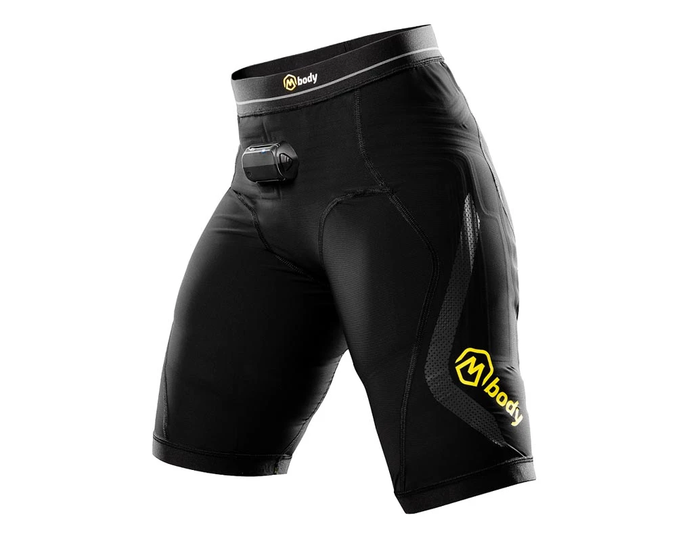
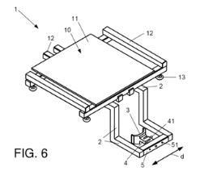
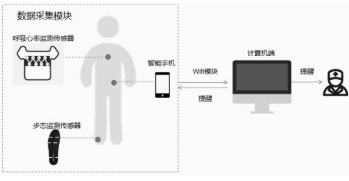

# 📊 Proyecto del Curso
## 📝Título tentativo del proyecto
Sistema de detección temprana de fatiga muscular en futbolistas jóvenes mediante el análisis de señales electromiográficas.
## ⚠️ Problemática a abordar
La falta de monitoreo de la fatiga deja a los jóvenes futbolistas expuestos a lesiones que podrían prevenirse al detectar a tiempo el cansancio excesivo.
## 📚 Justificación de la problemática  
La fatiga muscular no detectada a tiempo es un factor contribuyente en las frecuentes lesiones que sufren los jóvenes futbolistas. De hecho, las distensiones musculares constituyen una proporción importante de las lesiones totales en el fútbol juvenil; por ejemplo, en divisiones formativas se ha reportado que 27,13% de todas las lesiones son de tipo muscular, siendo las contracturas la forma más común con un 66.54% [1]. Gran parte de estas lesiones musculares ocurren en situaciones de fatiga: las sobrecargas de isquiotibiales (una de las lesiones musculares más típicas, que representa alrededor del 12% de todas las lesiones en futbolistas) y cuadríceps suelen producirse hacia el final de los partidos o entrenamientos [2].

Por un lado, forzar el músculo fatigado incrementa el riesgo de desgarros y distensiones que resultan en dolor, pérdida de movilidad y necesidad de interrupción del entrenamiento. Por otro lado, la reincidencia de lesiones musculares es alta si no se da un tiempo de recuperación adecuado, lo que puede iniciar un ciclo de lesión-crónica si el deportista vuelve a jugar sin haberse recuperado completamente [3].

Aunque existen directrices médicas y deportivas que respaldan la necesidad de mejorar la prevención de fatiga en futbolistas jóvenes (guías de medicina deportiva, calendarios con fechas preestablecidas, entre otros) mediante buenas prácticas como acondicionamiento físico progresivo, equipamiento protector, técnica correcta y respeto por los periodos de recuperación muscular [4]; estas normas preventivas muchas veces no se implementan plenamente en el deporte formativo en países como Perú. Asimismo, un análisis reciente sobre el fútbol profesional en Perú reportó que la incidencia de lesiones durante los partidos se mantuvo similar entre la temporada regular 2023 y la temporada desarrollada en pandemia (2020), la incidencia de lesiones incrementó (de 25.6 a 28,5) así como también el número total de lesiones registradas (de 228 a 313) [5].

En consecuencia, cada lesión no evitada representa días de incapacidad física, costos médicos y, en el caso de futbolistas jóvenes, posibles retrasos en su formación académica [6]. Por lo tanto, la falta de preparación física adecuada y las limitaciones en la recuperación aumentan significativamente la severidad e impacto de las lesiones musculares, reforzando así la necesidad de implementar sistemas de prevención de fatiga accesibles para el contexto deportivo peruano.
## 💡 Motivación
Reconocer cuándo los músculos inferiores están propensos a la fatiga muscular en futbolistas jóvenes del Perú llenará un vacío de conocimiento y permitirá fundamentar mejoras en las políticas deportivas del fútbol nacional. Asimismo, aunque existe un estudio previo que relaciona el síndrome de Burnout (estado de agotamiento físico, mental y emocional por estrés) con la frecuencia de lesiones deportivas en futbolistas jóvenes del Perú [7], lo cierto es que no se encontraron datos medibles  ni cuantificables que permitan obtener información vital sobre el estado y funcionalidad de los músculos inferiores involucrados en este deporte. Por ende, este proyecto resalta la necesidad de establecer protocolos de detección temprana de fatiga en futbolistas jóvenes del Perú.
## 🎯 Objetivos a alcanzar  
### 🎓 Objetivo general
Diseñar y validar un sistema basado en electromiografía (EMG) que permita detectar la aparición de fatiga en músculos inferiores de futbolistas jóvenes.
### 🧭Objetivos específicos
- Seleccionar los músculos (isquiotibiales, en particular bíceps femoris y semitendinosus, y de apoyo cuadríceps como vastus medialis y rectus femoris) para evaluar patrones de fatiga mediante EMG.

- Adquirir señales EMG  siguiendo un protocolo de ejercicios repetitivos (sprints cortos, contracciones isométricas, entre otros) para inducir estados de reposo, pre-fatiga y fatiga.

- Procesar y filtrar las señales EMG con técnicas digitales (filtros Butterworth y notch) para la eliminación de ruidos.

- Desarrollar un algoritmo de clasificación en MATLAB/Python para discriminar entre estados de reposo, pre-fatiga y fatiga.

- Comparar señales propias con bases de datos (bíceps femoris, vastus medialis, rectus femoris, semitendinosus, hamstrings) para validar la consistencia de los patrones de fatiga.
## 🛠️Herramientas a utilizar
### Hardware
- Sensor BITalino (sensor de EMG) con electrodos de superficie.

- Computadora con interfaz de adquisición de BITalino.
### Software
- MATLAB (Signal Processing Toolbox, Classification Learner).

- Entorno de programación Python.
## 🗄️ Base de Datos
| **Título** | **Resumen** |
|------------|-------------|
| EMG dataset in Lower Limb - from UC Irvine | Base de datos de biceps femoris, vastus medialis, rectus femoris y semitendinosus [8]. |
| Individual differences in the neural strategies to control the lateral and medial head of the quadriceps during a mechanically constrained task | Base de datos de vastus lateralis (VL) y vastus medialis (VM) [9]. |
| Surface electromyographic signals collected during long-lasting ground walking of young able-bodied subjects | Base de datos de gastrocnemius lateralis (GL), tibialis anterior (TA), rectus femoris (RF), hamstrings (Ham), y vastus lateralis [10]. |
## 🔎Estado del Arte
### Producto 
#### Papers
| **Imagen** | **Título** | **Información** |
|---------------------------|------------|-------------|
| 

| Sensitivity to change of quadriceps and hamstrings muscle wearable electromyography outcomes during a professional soccer match | El trabajo explora el uso de la EMG textil en partidos de fútbol profesional, enfocándose en cuádriceps e isquiotibiales. Se encontró que esta técnica permite detectar cambios entre el primer y segundo tiempo, mostrando su utilidad para monitorear la carga neuromuscular, optimizar el rendimiento y reducir el riesgo de lesiones [11]. |
| 

 | Influence of Fatigue on the Rapid Hamstring/Quadriceps Force Capacity in Soccer Players | Este estudio, realizado en 17 futbolistas profesionales, evidenció que la fatiga disminuye la capacidad de generar fuerza rápida (RTD) y de activar los músculos en los primeros 100 ms de la contracción, destacando estos parámetros como más relevantes que las variaciones en los índices H/Q para comprender el riesgo de lesión [12]. |
| 

 | Scheduling Concurrent Training 48 versus 72 h after Simulated Match Play: Effects on Neuromuscular Function and Fatigue | Este estudio analizó la función neuromuscular, la fatiga y las respuestas de dolor muscular al entrenamiento concurrente realizado 48 h (MD+2) y 72 h (MD+3) después de un partido en deportes de equipo de campo, considerando la influencia de la programación del microciclo competitivo [13]. |

#### Productos Comerciales
| Imagen | Título | Información |
|--------|--------|-------------|
| 

| Myocene | El dispositivo permite evaluar la fatigabilidad muscular de los atletas en el campo, facilitando un mejor monitoreo de la fatiga para optimizar el rendimiento mediante entrenamientos adecuados y reducir el riesgo de sobreentrenamiento y lesiones [14]. |
| 

| Trigno Lite System | Sistema que combina sensores de grado de investigación con la facilidad de uso de una laptop o tableta, permitiendo obtener datos de EMG y movimiento de alta calidad con mínima configuración. Incluye herramientas de software avanzadas para la interpretación de las señales [15]. |
| 

 | Myontec MBody MShorts3 EMG | Prenda deportiva inteligente que, junto con el monitor EMG MCell3, permite registrar datos de entrenamiento de los músculos del muslo, cuádriceps y glúteos. Incluye sensores de movimiento en la cadera (IMU) y análisis mediante aplicación móvil [16]. |
#### Patentes
| Imagen | Título | Información |
|--------|--------|-------------|
| 

| WO2022258263A1 - Muscle fatigue determination method | Este método de determinación de la fatiga muscular consiste en electroestimular el músculo con cargas eléctricas a diferentes frecuencias, ajustadas de manera recursiva para generar fuerzas confiables y precisas en respuesta a la estimulación. A partir de estas fuerzas registradas, se determina el nivel de fatiga muscular [17]. |
| 

| A wearable sports fatigue monitoring and reminder system and method based on multi-channel optical signals | Sistema portátil de monitoreo y alerta de fatiga deportiva basado en señales ópticas multicanal, que permite construir un modelo preciso de detección de fatiga y ofrece una herramienta integrada para monitoreo médico del esfuerzo deportivo [18]. |
| 

| System for the prevention of muscle injuries, in particular injuries to the posterior thigh muscles, and specifically to the biceps femoris | Sistema diseñado para prevenir lesiones musculares en la zona posterior del muslo, especialmente en el bíceps femoral, mediante el uso de sensores electromiográficos adaptados al cuerpo [19]. |
### Técnico
| Imagen | Título | Información |
|--------|--------|-------------|
|  

 | Fatigue Monitoring Through Wearables: A State-of-the-Art Review | Artículo que destaca la relevancia de medir objetivamente la fatiga en contextos laborales y de seguridad, analizando el potencial de los wearables para monitoreo continuo y no invasivo. Evalúa ventajas, retos y vacíos en la investigación actual [20]. |
|

| Proposed Fatigue Index for the Objective Detection of Muscle Fatigue Using Surface Electromyography and a Double-Step Binary Classifier | Estudio que propone un algoritmo basado en un nuevo índice de fatiga, combinando análisis temporal y frecuencial de señales sEMG. Usando un clasificador binario de dos pasos, detectó fatiga muscular con 94,66% de precisión en pruebas sobre el deltoides medio [21]. |
|

| Acute and Residual Soccer Match-Related Fatigue: A Systematic Review and Meta-analysis | Estudio que caracteriza cómo se desarrolla y recupera la fatiga en fútbol profesional, considerando aspectos fisiológicos, neuromusculares, técnicos, bioquímicos y perceptuales, comparando simulaciones de partido con competición real [2]. |

## 📖Referencias bibliográficas
[1] G-SE, “Análisis estadístico de lesiones en fútbol juvenil,” G-SE, [En línea]. Disponible en: https://g-se.com/es/analisis-estadistico-de-lesiones-en-futbol-juvenil-2350-sa-u5a2181cdc2068

[2] D. Buchheit y P. Laursen, “Acute and Residual Soccer Match-Related Fatigue: A Systematic Review and Meta-analysis,” Sports Medicine, vol. 43, no. 5, pp. 313–338, 2013. doi: 10.1007/s40279-017-0798-8

[3] T. Reilly, A. M. Drust, y G. Atkinson, “Previous injury as a risk factor for injury in elite football: a prospective study over two consecutive seasons,” British Journal of Sports Medicine, vol. 40, no. 6, pp. 364–368, 2006. doi: 10.1136/bjsm.2006.026609.

[4] Autor(es) desconocido(s), “Artículo en Rehabilitación y Cirugía Ortopédica,” RECOT, vol. xx, no. xx, 2025. doi: 10.1016/j.recot.2025.07.019

[5] R. Mohr, P. Krustrup y J. Bangsbo, “Risk management: FIFA's approach for protecting the health of football players,” British Journal of Sports Medicine, vol. 39, no. 1, pp. 45–51, 2005. doi: 10.1136/bjsports-2011-090634.

[6] R. G. Haff, “Epidemiology of overuse and acute injuries among competitive collegiate athletes,” Journal of Athletic Training, vol. 47, no. 2, pp. 198–209, 2012. doi: 10.4085/1062-6050-47.2.198.

[7] Revistas UNMSM, “Asociación entre síndrome de Burnout y la frecuencia de lesiones deportivas en futbolistas de divisiones inferiores de clubes profesionales del Perú,” Therapia, vol. xx, no. xx, pp. xx–xx, 2021. doi: 10.21142/tl.2021.1760.

[8] UCI Machine Learning Repository, “EMG dataset in lower limb,” University of California Irvine, [En línea]. Disponible en: https://archive.ics.uci.edu/dataset/278/emg+dataset+in+lower+limb

[9] C. Hug et al., “Individual differences in the neural strategies to control the quadriceps,” Figshare Dataset, 2020. Disponible en: https://figshare.com/articles/dataset/12739133

[10] Goldberger A. et al., “sEMG database for lower limb,” PhysioNet, 2021. Disponible en: https://physionet.org/content/semg/1.0.1/

[11] R. N. Kalema, S. J. Duhig, T. Finni, A. Arumugam, and A. J. Pesola, “Sensitivity to change of quadriceps and hamstrings muscle wearable electromyography outcomes during a professional soccer match,” J. Sports Sci., pp. 1–10, Feb. 2025. Available: https://doi.org/10.1080/02640414.2025.2469462

[12] J. Mendez-Villanueva et al., “Neuromuscular fatigue in soccer,” Medicine and Science in Sports and Exercise, vol. 53, no. 2, pp. 345–356, 2021. PMID: 33613321.

[13] G. Cormack et al., “Scheduling concurrent training 48 versus 72 h post-match,” Medicine & Science in Sports & Exercise, vol. 55, no. 2, pp. 233–243, 2023. Disponible en: https://journals.lww.com/acsm-msse/fulltext/2023/02000/scheduling_concurrent_training_48_versus_72_h.17.aspx

[14] Myocene, Myocene Device [En línea]. Disponible en: https://www.myocene.com/us/

[15] Delsys, Trigno Lite System [En línea]. Disponible en: https://delsys.com/product/trigno-lite/

[16] Myontec, MBody 3 Smart Shorts [En línea]. Disponible en: https://www.mindtecstore.com/Myontec-MBody-3-Smart-Short

[17] T. S. Ltd., “System and method for muscle fatigue detection,” WO Patent WO2022258263A1, 8 Dec. 2022.

[18] Inventores no listados, “Muscle fatigue monitoring based on multi-channel optical signals,” CN Patent CN118648877A, 2024.

[19] F. Boldi, “System for the prevention of hamstring injuries,” IT Patent IT202200015234A1, 20 Jul. 2022.

[20] J. Smith et al., “Fatigue Monitoring Through Wearables: A State-of-the-Art Review,” Frontiers in Physiology, vol. 12, p. 790292, 2021. doi: 10.3389/fphys.2021.790292.

[21] M. Garcia et al., “Proposed Fatigue Index for the Objective Detection of Muscle Fatigue Using Surface Electromyography and a Double-Step Binary Classifier,” Sensors, vol. 22, no. 5, p. 1900, 2022. doi: 10.3390/s22051900.