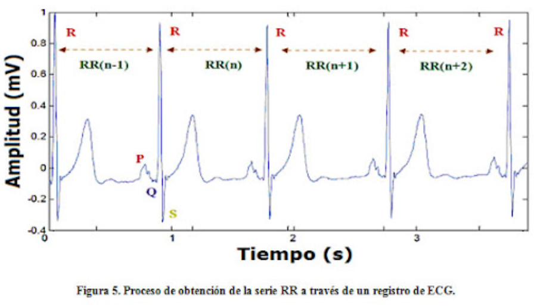
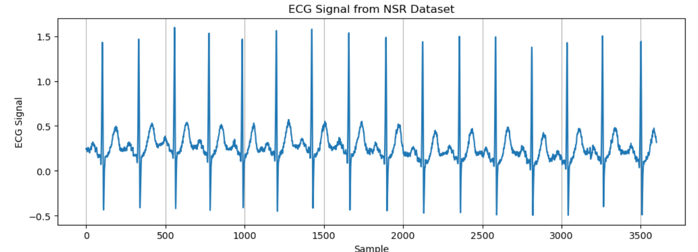
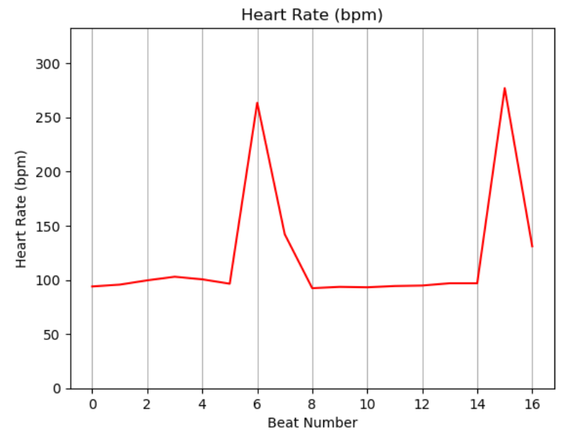
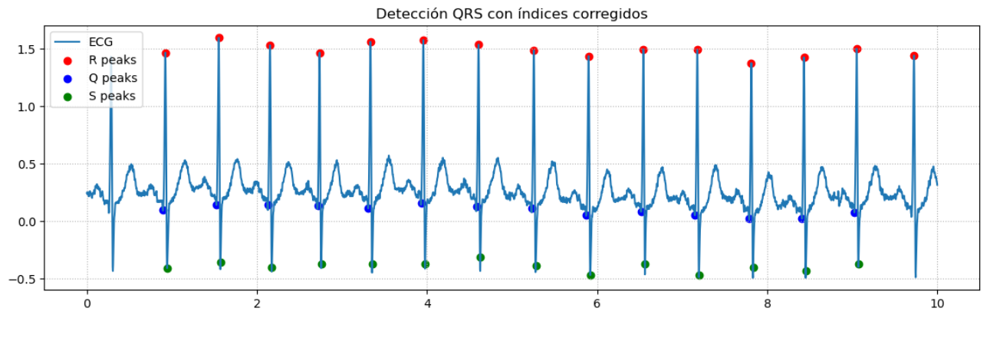

# 📉💓 Laboratorio 10: Procesamiento de señales EKG

##  Índice

- [1. Introducción](#1-introduccion)
- [2. Objetivos](#2-objetivos)
  - [2.1 Objetivo general](#21-objetivo-general)
  - [2.2 Objetivos específicos](#22-objetivos-especificos)
- [3. Metodología](#3-metodologia)
- [4. Resultados](#4-resultados)
  - [4.1 Señal Cruda](#41-señal-cruda)
  - [4.2 Análisis de onda P](#42-analisis-de-onda-p)
  - [4.3 Análisis de onda R](#43-analisis-de-onda-r)
  - [4.4 Análisis de segmento QRS](#44-analisis-de-segmento-qrs)
  - [4.5 Análisis de segmento T](#45-analisis-de-segmento-t)
- [5. Discusión](#5-discusion)
- [6. Conclusiones](#6-conclusiones)
- [7. Referencias](#7-referencias)
- [8. Aporte de los integrantes](#8-aporte)

## 🔍 1. Introducción

La señal del electrocardiograma (ECG) es de gran relevancia clínica, principalmente debido a la detección de anomalías cardiovasculares por medio de la morfología de sus ondas P,QRS y T, las cuales indican el patrón que sigue el corazón para su movimiento [1], [2]. Es por ello que el avance en el campo de procesamiento de señales en ECG es de vital importancia, en la cual se incluye el diseño y mejora de algoritmos de identificación de ondas P, QRS y T, entre otras características temporales y morfológicas [1], [2].

El principal objetivo de este campo es el diseño de algoritmos robustos que logren delinear con precisión los inicios, picos y finales de cada onda en cada latido [3]. A partir de ello, se podrán entrenar modelos de sistema de clasificación, los cuales serán capaces de distinguir patrones normales de los correspondientes a distintas clases patológicas [3]. El procesamiento previo se integra con el análisis de características morfológicas para completar el ciclo de reconocimiento automático [3].

## 🎯 2. Objetivos

### 2.1 Objetivo general

- Reconocer las ondas P, QRS y T de una señal EKG proveniente de una de las diecisiete clases del dataset del artículo “Novel methodology of cardiac health recognition based on ECG signals and evolutionary-neural system”

### 2.2 Objetivos específicos
- Importar las líbrerías de Python adecuadas para la detección de ondas en señales EKG.
- Aplicar filtros de distintos tipos para preparar la señal para el algoritmo de detección de ondas en señales EKG.
- Complementar la detección de ondas en señales con el cálculo de parámetros elementales de la señal EKG. 

## ⚙️💻 3. Metodología

El procesamiento se estructuró de manera que cada etapa respondiera a una necesidad específica del análisis ECG: eliminación de ruido, estabilización de la línea isoeléctrica, y posterior delineación de ondas P, QRS y T mediante algoritmos complementarios. A continuación, se describe el flujo metodológico y la lógica detrás de cada elección.

### 3.1. Importación de librerías y carga del dataset.
Se utilizaron numpy y scipy.signal para manipulación numérica y filtrado, matplotlib para visualización, pywt para transformada wavelet y neurokit2 como referencia validada para la detección de ondas. El dataset se cargó en formato pickle y se seleccionó el canal 1 de la clase NSR, lo que permitió trabajar con una señal de ritmo sinusal limpio y con buena relación señal-ruido, adecuada para comparar algoritmos.

### 3.2. Preprocesamiento de la señal.
La señal cruda mostró ruido de alta frecuencia y pequeñas variaciones de la línea base propias del dataset. Para mitigarlo, se aplicaron filtros de banda estrecha centrados en el rango fisiológico del ECG. En particular: Un filtrado básico 0.5–40 Hz (o similar según función), que atenúa ruido muscular y movimientos respiratorios.

En el caso específico de la onda P, se emplearon wavelets para realzar estructuras de baja amplitud. El uso de pywt permitió resaltar componentes entre 5–15 Hz, banda donde la P es más distinguible pese a su morfología pequeña y variable.

### 3.3. Detección de ondas P mediante dos enfoques.
Se compararon dos metodologías distintas:

* Método manual (detect_pwaves_only()): combinó filtrado, realce wavelet y umbrales adaptativos. Este enfoque no depende de la posición del R-peak, lo que permite evaluar el desempeño ante señales donde QRS no es necesariamente confiable. La contrapartida es su mayor sensibilidad al ruido y su tendencia a sobreestimar la duración.

* Método NeuroKit2: utiliza una cadena integrada de preprocesamiento, detección de R-peaks y alineamiento basado en ventanas fisiológicas, lo que produce estimaciones más estables. Se empleó la función ecg_process, que genera automáticamente los índices de inicio, pico y final de la onda P.

### 3.4. Detección de ondas R y cálculo de frecuencia cardiaca.
Para la onda R se emplearon también dos métodos:

* Método manual (promediado móvil + umbrales + detect_qrs_rpeaks): el promediado móvil reduce fluctuaciones rápidas, facilitando que los umbrales detecten picos prominentes. Posteriormente, se aplicó detect_qrs_rpeaks() para refinar la detección. El cálculo del RR se realizó mediante la función rr_intervals_ms.

* Método NeuroKit2: la detección automática de R-peaks utiliza heurísticas robustas inspiradas en Pan-Tompkins, con corrección de falsos positivos y ajuste de ventanas. Esto permitió obtener una frecuencia cardíaca más estable y fisiológicamente coherente.

### 3.5. Detección del complejo QRS.
Se utilizó exclusivamente NeuroKit2 para este segmento debido a que su delineación integrada (puntos Q, R y S) es más confiable que los métodos manuales, especialmente para señales sin patología evidente. El algoritmo corrige desplazamientos de índices y asegura que cada latido tenga marcados los tres componentes, lo cual es crucial para calcular duración y amplitud.

### 3.6. Detección y análisis de la onda T.
La onda T fue analizada mediante el pipeline de NeuroKit2, que identifica automáticamente sus puntos clave considerando la localización del complejo QRS previo. Este procedimiento permite evaluar duración, amplitud y el intervalo Tp-Te, métrica de repolarización ventricular asociada al riesgo arrítmico.

## 📊 4. Resultados

### 4.1 Señal cruda

### 4.2 Análisis de onda P

| Nombre | detect_pwaves_only()  | NeuroKit2 |
|------------|-------------|----------------|
| Detección P |   |  |
| Duración promedio | 116.6 ms | 89.63 ms |
| Amplitud promedio | 0.022 mV |  0.044 mV |
| Dispersión | 31.81 ms | 27.78 ms |

### 4.3 Análisis de onda R

| Nombre | detect_qrs_rpeaks | NeuroKit2 |
|------------|-------------|----------------|
| Detección R |  |  |
| Aproximación BPM |  |  |

| Nombre | rr_intervals_ms | NeuroKit2 |
|------------|-------------|----------------|
| Duración promedio | 555.39 ms | 628.57  ms |
| BPM promedio | 121.4 bpm | 95.98 bpm |

### 4.4 Análisis de segmento QRS

| Nombre | NeuroKit2 |
|------------|-------------|
| Detección QRS |  |
| Duración promedio | 78.17 ms |
| Amplitud promedio | 1.941 mV |
| Duración QRS mínima | 72.22 ms | 
| Duración QRS máxima | 83.33 ms |
| N° latidos analizados | 14 |

### 4.5 Análisis de onda T

| Nombre | NeuroKit2 |
|------------|-------------|
| Detección ondas T |  |
| Duración promedio | 167.06 ms |
| Amplitud promedio | 0.039 mV |
| TpTe promedio | 80.36 ms | 

## 🧠 5. Discusión

El análisis integral de la señal ECG permitió comprender cómo distintas estrategias de detección afectan la precisión en la identificación de ondas P, QRS, R y T. Las diferencias obtenidas entre los métodos manuales y los algoritmos de NeuroKit2 no solo reflejan variaciones técnicas, sino también la sensibilidad fisiológica inherente a cada onda y los desafíos que implica trabajar con un tipo de señal que combina componentes de muy distinta amplitud y frecuencia.

En primer lugar, la señal cruda del dataset NSR mostró un ritmo sinusal regular, con complejos QRS estrechos y bien definidos, y ondas P y T claramente distinguibles, aunque con amplitudes pequeñas típicas de literatura. Este punto es clave: cuando la señal inicia con buena calidad, cualquier diferencia entre métodos suele deberse más al algoritmo que a la morfología real del trazado. Sin embargo, incluso en este escenario “ideal”, la onda P resultó particularmente vulnerable a variaciones metodológicas. Esto es esperable, ya que la P es la onda de menor amplitud del ECG y, por lo tanto, la más dependiente del filtrado y de la correcta elección de umbrales.

En el caso específico de la onda P, la diferencia entre métodos fue notoria. El algoritmo manual basado en detect_pwaves_only() arrojó una duración promedio significativamente mayor (116.6 ms) que NeuroKit2 (89.63 ms). Este comportamiento se explica por la filosofía detrás del método: el enfoque manual, al depender de filtros y wavelets que resaltan la energía en bandas de interés, tiende a incluir parte del segmento PR inicial o final como parte de la onda P, especialmente cuando el gradiente entre la P y el QRS es suave. En cambio, NeuroKit2 utiliza la posición del R-peak para delimitar ventanas fisiológicamente probables para la P, lo cual evita errores como “capturar” ruido adyacente o incluir porciones de la línea isoeléctrica. La mayor amplitud promedio detectada por NeuroKit2 también es coherente con esta lógica: si el método manual detecta una P más extendida en el tiempo, su energía se distribuye, reduciendo el valor pico.

La dispersión de la onda P es otro indicador relevante. El método manual reportó 31.81 ms frente a 27.78 ms de NeuroKit2. Aunque ambas cifras son bajas (coherentes con un trazado estable), la diferencia sugiere que NeuroKit2 no solo detecta en promedio una P más fisiológica, sino que lo hace de manera más consistente entre latidos. Esta estabilidad interlatido es crucial en aplicaciones de clasificación automática, porque los modelos aprenden mejor cuando los parámetros presentan baja variabilidad intraclase.

En relación con la onda R, ambos métodos detectaron los picos correctamente, pero el comportamiento divergió al calcular la frecuencia cardíaca. El algoritmo manual, al basarse en umbrales y promediado móvil, mostró dos latidos que generaron valores atípicamente altos (>250 bpm). Esto se debe a que un pequeño error en la posición de un R-peak impacta de forma amplificada en el cálculo del RR interval. NeuroKit2 corrigió ese problema gracias a su sistema de postprocesamiento, que incluye validación de distancia mínima fisiológica entre latidos y eliminación de falsos positivos. Por esta razón, la frecuencia promedio obtenida por NeuroKit2 (~96 bpm) se alineó más estrechamente con el ritmo observado visualmente en la señal cruda.

El complejo QRS, por su parte, mostró una estabilidad llamativa con NeuroKit2: duración de 78 ms en promedio y valores mínimos y máximos dentro del rango fisiológico (70–110 ms). Esto confirma que el dataset NSR presenta un ritmo sinusal normal y que la librería realiza una correcta segmentación de los puntos Q, R y S. La amplitud promedio, alrededor de 1.94 mV, también coincide con ECG típicos donde el QRS es la onda dominante en términos de energía.

En cuanto a la onda T, la detección mediante NeuroKit2 reveló una duración promedio de 167 ms y un intervalo Tp–Te de 80 ms. Estos valores sugieren una repolarización ventricular normal, sin prolongaciones significativas que pudieran indicar riesgo eléctrico aumentado (como en QT prolongado o alteraciones en la dispersión transmural de la repolarización). La consistencia latido a latido indica que la señal está libre de artefactos significativos y que la onda T presenta buena morfología.

Un punto importante en esta discusión es la relación entre filtrado, morfología y método de detección. Las ondas de baja amplitud (P y T) dependen fuertemente del preprocesamiento. Por eso, incluso en señales limpias, los métodos manuales suelen mostrar mayor variabilidad. Por el contrario, los algoritmos optimizados como NeuroKit2 integran heurísticas fisiológicas—por ejemplo, que la onda P siempre precede al QRS por un intervalo razonable, o que la onda T nunca ocurre antes del segmento ST. Esto limita automáticamente la posibilidad de errores incluso si la señal presenta ruido moderado.

Finalmente, las diferencias globales entre ambos enfoques ilustran una idea central: los métodos manuales son valiosos para entender la naturaleza del ECG y para personalizar criterios de detección; sin embargo, su sensibilidad al ruido y a la selección de parámetros los vuelve menos adecuados para aplicaciones clínicas o computacionales a gran escala. Las herramientas validadas —como NeuroKit2— muestran mayor suavidad interlatido, robustez ante variabilidad y resultados más fisiológicamente plausibles.

## 📌 6. Conclusiones

El análisis permitió identificar con éxito las ondas P, QRS, R y T de una señal ECG correspondiente al ritmo sinusal normal (NSR). Los métodos implementados manualmente cumplieron su función educativa al evidenciar cómo filtros, wavelets y umbrales pueden generar detectores funcionales, aunque más sensibles al ruido y a la variabilidad entre latidos. En contraste, NeuroKit2 proporcionó mediciones más estables y fisiológicamente coherentes, reflejando la ventaja de algoritmos optimizados que integran correlaciones entre ondas y correcciones post-procesamiento.

A nivel morfológico, los parámetros obtenidos (duración de P ~90–116 ms, QRS ~78 ms, T ~167 ms, BPM ~96–121) se encuentran dentro de los rangos esperados para un sujeto con ritmo sinusal, lo cual valida tanto la calidad de la señal utilizada como la eficacia de los algoritmos aplicados. La diferencia en los valores de BPM entre métodos evidencia la importancia de una buena detección de R-peaks para evitar errores acumulativos en RR y frecuencia cardíaca.

## 📚🔗 7. Referencias

[1] A. Zyout, H. Alquran, W. A. Mustafa y A. M. Alqudah, “Advanced Time-Frequency Methods for ECG Waves Recognition”, Diagnostics, vol. 13, n.º 2, p. 308, enero de 2023. Accedido el 24 de noviembre de 2025. [En línea]. Disponible: https://doi.org/10.3390/diagnostics13020308

[2] R. Costa, T. Winkert, A. Manhães y J. P. Teixeira, “QRS Peaks, P and T Waves Identification in ECG”, Procedia Comput. Sci., vol. 181, pp. 957–964, 2021. Accedido el 24 de noviembre de 2025. [En línea]. Disponible: https://doi.org/10.1016/j.procs.2021.01.252  

[3] H. Dogan y R. O. Dogan, “A Comprehensive Review of Computer-based Techniques for R-Peaks/QRS Complex Detection in ECG Signal”, Arch. Comput. Methods Eng., abril de 2023. Accedido el 24 de noviembre de 2025. [En línea]. Disponible: https://doi.org/10.1007/s11831-023-09916-x 

## 🗂️ 8. Aporte de los integrantes

| Integrante      | Contribución (%) |
|-----------------|:------------------:|
| Salet Garcia    | 33.33%           |
| Dhiago Llanos   | 33.33%           |
| Rafael Panez    | 33.33%           |

