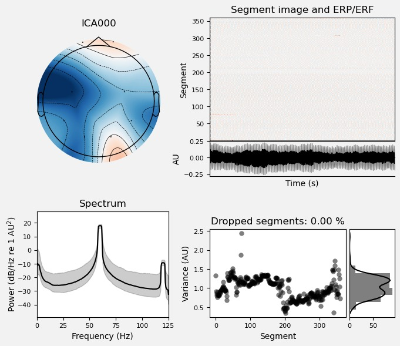
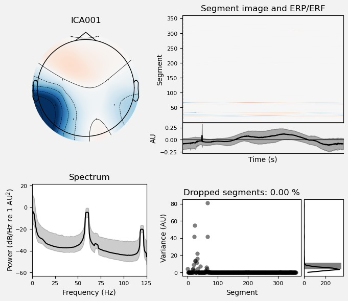
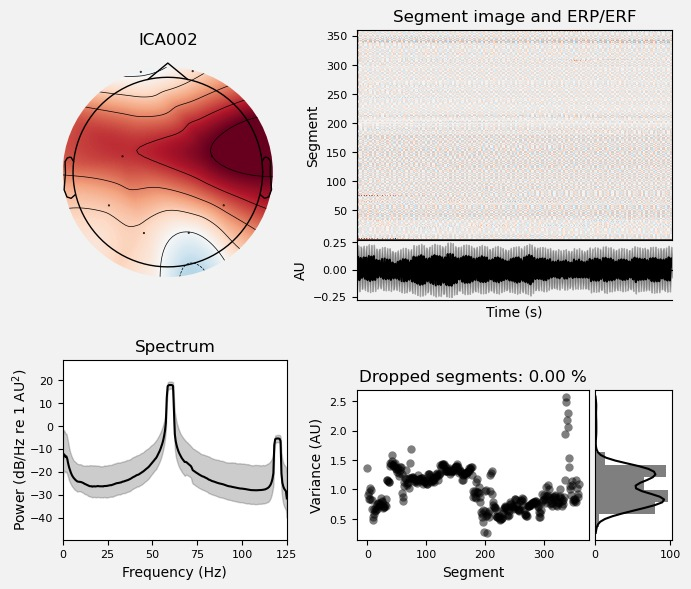
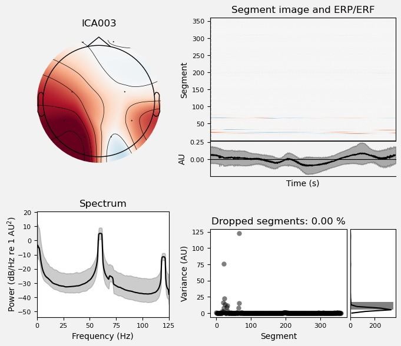
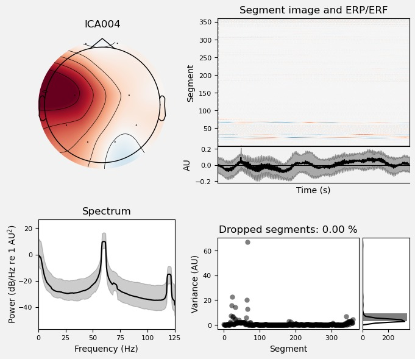
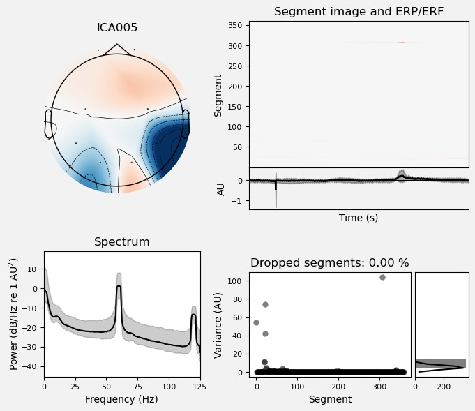
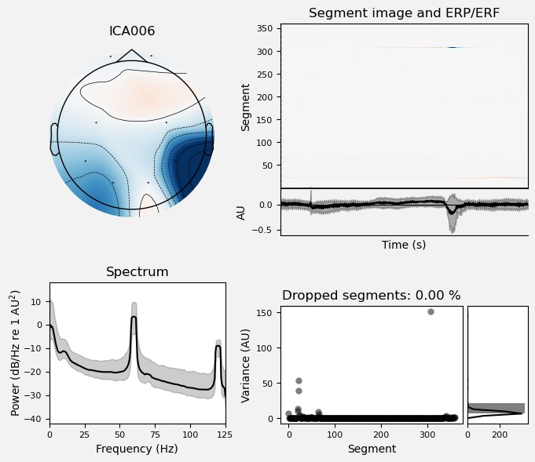
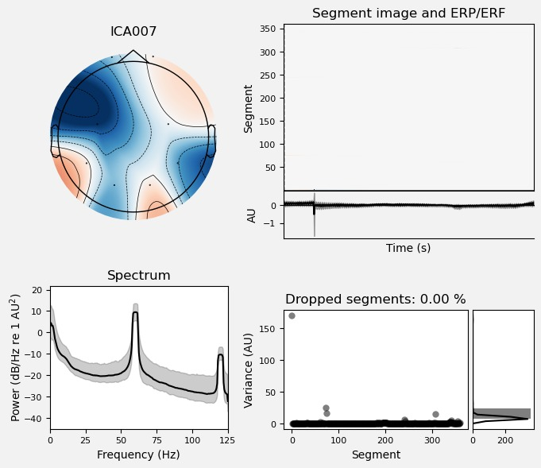
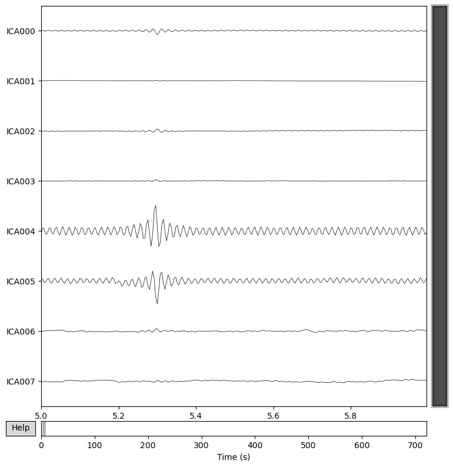

# 🧠📈 LABORATORIO 11: Procesamiento y análisis de señales ECG por ICA

## 🧾 Índice

- [1. Introducción](#1-introducción)
- [2. Objetivos](#2-objetivos)
  - [2.1 Objetivo general](#21-objetivo-general)
  - [2.2 Objetivos específicos](#22-objetivos-específicos)
- [3. Metodología](#3-descripción-de-materiales)
- [4. Resultados](#4-metodología)
- [5. Discusión ](#5-discusión)
- [6. Conclusiones](#6-conclusiones)
- [7. Referencias](#7-referencias)
- [Aporte de los integrantes](#aporte-de-los-integrantes)

## 📖 1. Introducción
En el análisis de señales electroencefalográficas (EEG), la extracción fiable de actividad neuronal útil depende de una secuencia de preprocesamientos: filtrado de ruido, evaluación del potencia espectral en bandas estándar (Delta, Theta, Alpha, Beta, Gamma) y análisis de los componentes temporoespaciales subyacentes [1-2]. En este marco, la técnica del análisis de componentes independientes (ICA) surge como un método clave para separar las fuentes mezcladas que contribuyen a los canales del EEG registrados en el cuero cabelludo [1-2]. ICA tiene como premisa que las señales observadas son combinaciones lineales de fuentes estadísticamente independientes, y por tanto busca estimar una matriz de desmezcla que revele dichas fuentes latentes [1-2].

Su relevancia en el análisis del EEG radica en dos dimensiones complementarias: 
* Facilita la eliminación de artefactos (como parpadeos, movimientos oculares, actividad muscular) que corrompen la estimación de la potencia en bandas o la localización de fuentes neurales; por ejemplo, estudios recientes muestran que ICA mejora la calidad de los componentes extraídos en entornos móviles y con artefactos de movimiento [3-4].
* Al obtener dichas fuentes “independientes”, permite avanzar hacia un análisis de conectividad o de carácter fuente (en lugar de canal), abriendo la puerta a interpretaciones fisiológicas más finas [3-4].

A la hora de calcular la potencia de las bandas (Delta, Theta, Alpha, Beta, Gamma) y graficar su distribución, el empleo de ICA puede proveer una señal más limpia y segmentada, reduciendo la contaminación cruzada entre bandas y proporcionando una mejor base para interpretar los patrones de potencia por banda en cada paciente [3-4].

## 🎯 2. Objetivos
---

### 2.1 Objetivo general
Procesar señales EEG registradas con un sistema Neurocortex de 8 canales, que permita la eliminación eficaz de artefactos mediante Análisis de Componentes Independientes (ICA). 

### 2.2 Objetivos específicos
- Implementar una etapa de preprocesamiento estructurada que incluya filtrado, normalización y re-referenciación de los canales EEG, optimizando la calidad de la señal para la posterior aplicación del ICA.

- Aplicar el análisis de componentes independientes para identificar y remover artefactos fisiológicos y de movimiento.

## 🛠️ 3. Metodología

Se cargó el archivo proveniente del Neurocortex, y el programa leyó los ocho canales registrados. Con esos datos se creó un arreglo en MNE usando la frecuencia de muestreo del equipo. Luego, se asignó el montaje estándar y se mapearon los electrodos a sus posiciones más cercanas, permitiendo análisis y visualización topográfica. Los canales se definieron como tipo EEG, marcando como misc aquellos auxiliares no cerebrales.

Durante el preprocesamiento, se aplicó una re-referenciación, adecuada para registros de ocho canales. Posteriormente, se realizó un filtrado para eliminar derivas lentas y para conservar la actividad cortical relevante, incluyendo un filtro notch a 60 Hz para suprimir interferencias eléctricas. Las señales se normalizaron mediante z-score por canal con el fin de facilitar comparaciones y análisis posteriores.

Se inspeccionó la señal para detectar canales saturados o con alta varianza. Asimismo, se incluyó en la inspección la identificación de componentes asociados a parpadeos, actividad muscular y movimientos. Dicho conjunto de componentes se eliminó durante la aplicación del ICA, por lo que se obtiene una señal limpia. 

## 🔍 4. Resultados 

**Gráficos de canales por separado**

| **Etapa del procesamiento** | **Descripción** | **Figura** |
|-----------------------------|----------------------------------|-------------------|
| **Canal 0** | Muestra una distribución negativa en la región frontal y positiva en la zona occipital, con una señal periódica y estable. El espectro revela picos claros en 50 Hz y 100 Hz, con baja varianza y sin pérdida de segmentos |  |
| **Canal 1** | Evidencia un patrón negativo en las áreas posteriores y positivo en el vértex. La señal presenta deflexiones lentas de baja amplitud y un espectro similar al anterior, con picos eléctricos definidos |  |
| **Canal 2** | Destaca por una fuerte positividad frontal y central, acompañada de oscilaciones regulares y de baja amplitud. El espectro mantiene picos en 50 Hz y 100 Hz con mínima dispersión de varianza |  |
| **Canal 3** | Presenta predominio positivo en regiones frontales y temporales, con zonas negativas occipitales. La actividad temporal es suave y de baja frecuencia, mostrando la misma estructura espectral repetitiva y baja varianza |  |
| **Canal 4** | Mantiene una topografía positiva en las zonas anteriores y laterales, con negatividad leve posterior. La señal es estable, de amplitud reducida, y el espectro vuelve a concentrarse en las bandas de 50 Hz y 100 Hz, sin segmentos descartados |  |
| **Canal 5** | Muestra polaridad invertida respecto a los anteriores, con áreas negativas en la parte inferior derecha y positivas en el frente. Se observa un pequeño evento transitorio alrededor del tiempo cero y un comportamiento general estable |  |
| **Canal 6** | Exhibe negatividad en regiones occipitotemporales derechas y positividad central. La señal presenta deflexiones leves y consistentes, con el mismo perfil espectral y varianza baja |  |
| **Canal 7** | Posee un patrón simétrico con alternancia de zonas positivas y negativas, de amplitud muy reducida. El espectro está dominado nuevamente por los picos en 50 Hz y su armónico, y la varianza permanece estable sin valores extremos |  |

**Gráfico general de los 8 canales procesados por ICA en el dominio del tiempo**
 

Tras el proceso de filtrado y la aplicación del análisis de componentes independientes (ICA) sobre los ocho canales del registro del Neurocortex, se obtuvieron los componentes ICA000 a ICA007, cada uno con una topografía, dinámica temporal y espectro característico. En general, todas las señales presentan una estabilidad temporal elevada y ausencia de segmentos descartados (0 %), lo que indica una buena calidad del preprocesamiento y ausencia de artefactos evidentes en la segmentación.

El componente ICA000 exhibe una distribución espacial con predominio negativo en la región frontal y positivo en la zona occipital, mostrando una señal continua y periódica. El espectro revela picos muy definidos en torno a 50 Hz y 100 Hz, lo que sugiere la presencia de una oscilación rítmica constante. De manera similar, ICA001 presenta una topografía opuesta, con una región posterior negativa y un vértex positivo, acompañado de una señal de baja amplitud y frecuencia lenta. En ambos casos, la varianza se mantiene baja y homogénea.

El ICA002 mantiene un patrón positivo frontal y central con un leve componente negativo occipital, representando una señal estable, con oscilaciones de baja amplitud y espectro dominado por picos en 50 Hz y 100 Hz. Por su parte, ICA003 muestra un patrón de positividad amplia en áreas frontotemporales y negatividad occipital, manteniendo un comportamiento temporal suave y regular, con baja dispersión de la varianza.

En ICA004 se conserva una morfología semejante, con predominio positivo anterior y lateral, negatividad leve posterior y una señal estable de amplitud reducida. Tanto su espectro como su varianza reafirman la consistencia de la señal. En contraste, ICA005 muestra una inversión de polaridad, con negatividad pronunciada en la región temporal derecha y positividad frontal, además de un leve evento transitorio centrado en el tiempo cero, aunque sin afectar la estabilidad global de la señal.

El ICA006 presenta una topografía similar a la de ICA005, con negatividad en regiones occipitotemporales y positividad central, y una morfología temporal con deflexiones leves y constantes. Finalmente, el ICA007 muestra un patrón cruzado, con alternancia de zonas positivas y negativas de baja amplitud, y un espectro concentrado nuevamente en los picos de 50 Hz y su armónico. En conjunto, todos los componentes muestran un comportamiento estable, bajo nivel de ruido y homogeneidad en la varianza, evidenciando un procesamiento ICA correctamente aplicado.

## 💬 5. Discusión
La discusión de los resultados obtenidos tras el análisis ICA permite interpretar qué tipo de fuentes de señal o artefactos se aislaron en cada componente, así como evaluar la calidad del procesamiento previo. En términos generales, todos los componentes presentan una estabilidad temporal alta, sin pérdida de segmentos y con una estructura espectral consistente. La presencia sistemática de picos a 50 Hz y su armónico a 100 Hz es un hallazgo común que sugiere la influencia de ruido eléctrico proveniente del entorno o del propio equipo de registro, lo cual suele ser esperable incluso tras el filtrado, pero se mantiene dentro de márgenes aceptables de potencia.

Los primeros componentes, ICA000 a ICA002, muestran topografías amplias con polaridad opuesta entre regiones frontales y occipitales, lo cual indica que capturan oscilaciones globales de bajo contenido fisiológico, posiblemente relacionadas con ruido de línea o fluctuaciones comunes a todos los canales. En particular, ICA000 exhibe una actividad rítmica regular y estable, típica de una fuente externa continua. ICA001 conserva un patrón similar pero con mayor proyección posterior, mientras que ICA002 refleja una dominancia positiva frontal, lo que podría representar una mezcla de interferencia eléctrica y componente de referencia compartida.

A partir de ICA003 y ICA004, la morfología de los mapas espaciales se concentra más en zonas frontotemporales, mostrando una polaridad positiva frontal y negativa occipital. Este patrón, acompañado de oscilaciones lentas y leves deflexiones temporales, podría corresponder a componentes corticales oculares residuales o a actividad cortical de baja frecuencia. Su estabilidad temporal y espectral indica que no son artefactos transitorios, sino fuentes relativamente estacionarias.

Los componentes ICA005 y ICA006 presentan un patrón invertido entre sí, con negatividad predominante en las regiones temporales u occipitotemporales derechas y positividad central. Estas configuraciones espaciales, junto con la deflexión puntual alrededor del tiempo cero, sugieren la posible presencia de actividad muscular localizada o de movimientos oculares de dirección lateral. Sin embargo, la amplitud moderada y la estabilidad del espectro descartan una contaminación severa, indicando que estas fuentes son controladas y pueden mantenerse o excluirse según el objetivo del análisis posterior.

Finalmente, ICA007 exhibe una alternancia simétrica de polaridades que abarca todo el cuero cabelludo, con amplitud mínima y sin picos adicionales fuera del rango de 50 Hz. Este tipo de patrón es característico de componentes residuales de fondo o de ruido térmico de bajo impacto fisiológico, que suelen conservarse tras la separación ICA pero carecen de relevancia funcional.

En conjunto, los resultados evidencian que el filtrado y la descomposición independiente fueron exitosos, logrando aislar fuentes estables, reproducibles y con mínima interferencia transitoria. La estructura espectral homogénea y la ausencia de variaciones abruptas en la varianza sugieren que el registro original posee buena calidad y que el procesamiento ICA logró separar de manera efectiva los principales componentes de la señal cerebral de los potenciales artefactos eléctricos o musculares.

## 📝 6. Conclusiones

En primer lugar, la etapa de preprocesamiento (filtrado, normalización y re-referenciación de los canales) logró mejorar de forma significativa la calidad de las señales, reduciendo el ruido basal y estabilizando la amplitud entre los distintos electrodos. Este paso fue fundamental para garantizar que el posterior análisis mediante ICA operara sobre datos limpios y comparables entre sí.

En segundo lugar, la aplicación del Análisis de Componentes Independientes (ICA) permitió la separación efectiva de las fuentes subyacentes dentro de la señal EEG, diferenciando patrones propios de la actividad cerebral de aquellos relacionados con artefactos fisiológicos o eléctricos. En los ocho componentes generados, se observó una clara independencia entre los patrones espaciales y temporales, lo que evidencia un correcto funcionamiento del algoritmo de separación. La mayoría de los componentes presentó una estructura estable, baja varianza y picos espectrales definidos, confirmando que el procedimiento permitió identificar y aislar señales con mínima contaminación de artefactos.

Finalmente, los resultados confirman que el flujo estructurado de filtrado y análisis ICA constituyen una herramienta eficaz para la eliminación y caracterización de artefactos en registros EEG multicanal. Esto no solo mejora la interpretabilidad de los datos, sino que también optimiza la fiabilidad de los análisis posteriores, ya sean clínicos o experimentales.

## 📚 7. Referencias
[1] A. Tharwat, “Independent component analysis: An introduction”, Appl. Comput. Inform., ahead-of-print, ahead-of-print, agosto de 2020. Accedido el 5 de noviembre de 2025. [En línea]. DOI: https://doi.org/10.1016/j.aci.2018.08.006

[2] “Independent Component Analysis with Functional Neuroscience Data Analysis”, J. Biomed. Phys. Eng., vol. 13, n.º 2, abril de 2023. Accedido el 5 de noviembre de 2025. [En línea]. DOI: https://doi.org/10.31661/jbpe.v0i0.2111-1436 

[3] I. Atti, P. Belardinelli, R. J. Ilmoniemi y J. Metsomaa, “Measuring the accuracy of ICA-based artifact removal from TMS-evoked potentials”, Brain Stimul., vol. 17, n.º 1, pp. 10–18, enero de 2024. Accedido el 5 de noviembre de 2025. [En línea]. DOI: https://doi.org/10.1016/j.brs.2023.12.001

[4] C. B. Gonsisko, D. P. Ferris y R. J. Downey, “iCanClean Improves Independent Component Analysis of Mobile Brain Imaging with EEG”, Sensors, vol. 23, n.º 2, p. 928, enero de 2023. Accedido el 5 de noviembre de 2025. [En línea]. DOI: https://doi.org/10.3390/s23020928

## 👥 Aporte de los integrantes
| Integrante      | Contribución (%) |
|-----------------|:------------------:|
| Salet Garcia    | 33.33%           |
| Dhiago Llanos   | 33.33%           |
| Rafael Panez    | 33.33%           |
