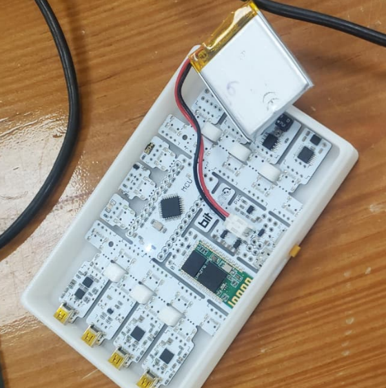

# LABORATORIO 5:  Uso de BiTalino para adquisición y análisis de señales EEG
---

## 1. Introducción

El electroencefalograma (EEG) es una técnica no invasiva que permite registrar la actividad eléctrica del cerebro mediante electrodos colocados en el cuero cabelludo [1]. Esta herramienta resulta fundamental en neurociencia y medicina clínica, ya que posibilita la evaluación de funciones cerebrales y el diagnóstico de distintos trastornos neurológicos [1]. Asimismo, el EEG facilita la monitorización continua de la actividad cerebral en pacientes críticos y la evaluación de la eficacia de tratamientos neurológicos, constituyéndose como un instrumento indispensable en investigación y entornos clínicos [2].

La generación de las señales EEG se produce principalmente en las neuronas piramidales de la corteza cerebral, ubicadas en las capas III y V [3-4]. Estas neuronas presentan una orientación perpendicular a la superficie cortical, lo que permite la formación de dipolos eléctricos detectables en el cuero cabelludo. La actividad registrada corresponde a la suma de los potenciales postsinápticos excitatorios e inhibitorios de grandes grupos de neuronas activadas de manera sincronizada [3]. Las oscilaciones resultantes se organizan en ritmos de alfa (8–13 Hz), beta (13–30 Hz), theta (4–8 Hz) y delta (0.5–4 Hz), cada uno asociado a distintos estados de conciencia y funciones cognitivas [3].

En cuanto a sus aplicaciones, el EEG constituye una herramienta esencial para el diagnóstico de epilepsia y la localización precisa de focos epilépticos, así como para estudios de sueño orientados a identificar trastornos como la narcolepsia [5]. De igual manera, la integración del EEG con técnicas de aprendizaje automático ha permitido el desarrollo de interfaces cerebro-computadora (BCI), lo que posibilita la comunicación y el control de dispositivos por parte de personas con discapacidades motoras [6].

**Figura 1.** Generación de señales EEG a partir de dipolos eléctricos formados por neuronas piramidales alineadas [4].

---
## 2. Objetivos

### 2.1 Objetivo general
—
Comprender el proceso de adquisición y procesamiento de señales de electroencefalograma (EEG) mediante su aplicación en el análisis de la actividad cerebral bajo diferentes condiciones experimentales.

### 2.2 Objetivos específicos
---

## 🛠️ 3. Instrumentos
---

|             Ítem              |                  Descripción                    |              Cantidad            |
|----------------------------|------------------------------------------------|:----------------------------------:|
|  BiTalino (r)evolution   |     Módulo de adquisición de señales biomédicas, incluye entradas para señales ECG, EMG, EEG y EDA.     |   1  |
| Cable para 3 electrodos |  Conector tripolar para la conexión de electrodos y el módulo de adquisición.     | 1 |
| Batería recargable LIPO 3.7V - 500mA |     Fuente de energía portátil para el  módulo BiTalino (r)evolution.         | 1 |
| Electrodos de superficie |  Sensores descartables para el registro de señales biomédicas.  |  3  |
| Laptop |     Equipo utilizado para la obtención de señales con el software OpenSignals (r)evolution  y procesamiento con Python.    |  1  |
| Ultracortex Mark IV (dry-electrode headset) |     Caso EEG abierto y modular diseñado para registrar actividad cerebral en aplicaciones de neurociencia, BCI y neurotecnología DIY    |  1  |

|  |  |  |
|:---------:|:---------:|:---------:|
| **(a)** | **(b)** | **(c)** |

**Figura 2**. Materiales utilizados para la realización del experimento. De izquierda a derecha: (a) BiTalino (r)evolution con batería (b) Laptop para adquisición de señales (c) Ultracortex Mark IV

## 📝 4. Marco teórico
---
### 4.1 Marco teórico
#### EEG y ritmos cerebrales
La electroencefalografía (EEG) registra diferencias de potencial generadas por poblaciones neuronales corticales. En reposo con ojos cerrados, el ritmo alfa (≈8–12 Hz) suele predominar, con mayor amplitud en regiones parieto-occipitales; al abrir los ojos o aumentar la demanda atencional, la potencia alfa típicamente disminuye.

#### Sistema 10–20 y Fp1/Fp2
El sistema internacional 10–20 define posiciones estándar; Fp1 (frontal polar izquierdo) y Fp2 (frontal polar derecho) son sensibles a actividad frontal pero también a artefactos oculares (parpadeo/sacádicos) por su proximidad a los ojos, por lo que las trazas en estos puntos suelen presentar diferencias si cambia el patrón de parpadeo, el contacto electrodo-piel o la referencia.

#### Preprocesamiento y filtrado
Para conservar las bandas fisiológicas y mejorar la SNR, es práctica común aplicar un filtro pasabanda (p. ej., ~0.5–40/80 Hz) y un notch a 50/60 Hz para la red eléctrica. La literatura reciente resalta que las decisiones de filtrado impactan latencias y amplitudes, por lo que deben reportarse explícitamente (tipo de filtro, orden y banda).

#### Electrodos secos/húmedos
Los electrodos secos facilitan el montaje rápido y reutilizable (útiles con cascos tipo Ultracortex), mientras que los húmedos suelen ofrecer mayor amplitud/estabilidad en registros pasivos; la calidad depende del diseño y de si los electrodos son activos.

---
### 4.2 Procedimiento experimental
#### Preparación del sujeto y del equipo
1. Explicar el procedimiento, retirar accesorios metálicos frontales y **limpiar piel** en sitios de registro.  
2. Verificar **batería/conexión** del sistema y crear el proyecto de adquisición (frecuencia de muestreo ≥**250–500 Hz**; mayor si analizarás >40 Hz) [10].

> **Inserta aquí** una foto del **montaje general** (casco/cintas y módulo de adquisición).  
> `<!-- Figura 1: Montaje de adquisición EEG -->`

#### Colocación de electrodos (10–20)
3. Ubicar **Fp1** y **Fp2** según 10–20. Colocar referencia (p. ej., mastoides o A1/A2) y tierra según tu hardware. Asegurar buen contacto y **baja impedancia** [6].

> **Inserta aquí** un **esquema 10–20** resaltando Fp1/Fp2.  
> `<!-- Figura 2: Mapa 10–20 con Fp1/Fp2 -->`

#### Protocolo de adquisición
4. **Reposo ojos abiertos (EO):** 2–3 min mirando un punto fijo, respiración normal.  
5. **Reposo ojos cerrados (EC):** 2–3 min, relajado, evitar movimientos.  
6. (Opcional) **Tarea cognitiva breve** (p. ej., restas seriadas) para observar cambios espectrales.  
7. **Marcado de eventos**: anotar cambios EO/EC, parpadeos voluntarios y eventos notables [1].

#### Preprocesamiento
8. **Revisión visual** y marcado de segmentos con artefactos obvios (movimientos, EMG facial). Los parpadeos impactan especialmente **Fp1/Fp2** [7].  
9. **Filtrado**: aplicar **pasabanda** ~**0.5–40 Hz** (o 0.5–80 Hz si requieres gamma baja) y **notch** a **50** (o **60**) Hz según tu red eléctrica. Reportar: tipo (FIR/IIR), orden y transitorio [3], [4], [5].  
10. (Opcional) **Re-referencia** (promedio común o referencia vinculada) si tu montaje lo permite [3].

#### Análisis cuantitativo
11. **Segmentación**: extraer **épocas** estables (p. ej., 4–8 s) en EO y EC, libres de artefacto [3].  
12. **PSD (Welch)** por canal (Fp1, Fp2): ventana 2–4 s, solape 50%, Hanning. Estimar **potencia en bandas**: delta (0.5–4), theta (4–7), **alfa (8–12)**, beta (13–30). Espera **↑alfa en EC** frente a EO [1], [2].  
13. **Comparaciones**:  
   - **EO vs EC**: diferencia o razón de potencia alfa por canal.  
   - **Fp1 vs Fp2**: comparar potencia en bandas; interpretar asimetrías considerando artefactos oculares y diferencias de contacto [7].

> **Inserta aquí** los **gráficos de PSD** (EO y EC) y, si quieres, **barras** de potencia alfa por condición y canal.  
> `<!-- Figura 3: PSD Fp1/Fp2 EO vs EC -->`  
> `<!-- Figura 4: Potencia alfa por condición (box/bar) -->`

## 6. Referencias
—
https://jamanetwork.com/journals/jamaneurology/article-abstract/581666 
https://pubmed.ncbi.nlm.nih.gov/19715175/
https://pubmed.ncbi.nlm.nih.gov/10576479/ 
https://publications.idiap.ch/downloads/reports/2007/uldry-idiap-com-07-04.pdf 
https://www.neurotherapeuticsjournal.org/article/S1878-7479(23)01188-1/fulltext 
https://pubmed.ncbi.nlm.nih.gov/39346532/ 

