# 🧠 LABORATORIO 5:  Uso de BiTalino para adquisición y análisis de señales EEG
---

## 📑 Índice
---

- [1. Introducción](#1-introducción)
- [2. Objetivos](#2-objetivos)
  - [2.1 Objetivo general](#21-objetivo-general)
  - [2.2 Objetivos específicos](#22-objetivos-específicos)
- [3. Instrumentos](#3-instrumentos)
- [4. Metodología](#4-metodologia)
  - [4.1 Marco teórico](#41-marco-teórico)
     - [4.1.1 Generación de la señal EEG](411-generacion-de-la-señal)
     - [4.1.2 Bandas y reactividad alfa (EO vs EC)](#412-bandas-y-reactividad-alfa-(E0-vs-EC))
     - [4.1.3 Sistema 10–20, Fp1/Fp2 y artefactos oculares](#413-sistema-10-20,-Fp1/Fp2-y-artefactos-oculares)
     - [4.1.4 Electrodos: húmedos vs secos](#414-electrodos-húmedos-vs-secos)
     - [4.1.5 Muestreo, referencia y filtrado](#415-muestra,-referencia-y-filtrado)
  - [4.2 Procedimiento experimental](#42-procedimiento-experimental)
     - [4.2.1 Preparación de software y proyecto](#421-preparación-de-software-y-proyecto)
     - [4.2.2 Montaje de electrodos](#422-montaje-de-electrodos)
     - [4.2.3 Secuencia de registro](#423-secuencia-de-registro)
     - [4.2.4 Exportación y respaldo](#425-exportación-y-respaldo)
     - [4.2.5 Preprocesamiento](#425-preprocesamiento)
     - [4.2.6 Análisis cuantitativo](#426-análisis-cuantitativo)
- [5. Resultados](#5-resultados)
  - [5.1 Repositorio de vídeos](#51-repositorio-de-vídeos)
  - [5.2 Gráficas obtenidas](#52-gráficas-obtenidas)
    - [5.2.1 Señales EEG crudas y filtradas durante reposo (ojos cerrados) y fijación visual (ojos abiertos)](#521-señales-eeg-crudas-y-filtradas-durante-reposo-ojos-cerrados-y-fijación-visual-ojos-abiertos)
    - [5.2.3 Potencia relativa (%) por banda](#523-potencia-relativa--por-banda)
    - [5.2.4 Comparación de potencia α: ojos cerrados vs ojos abiertos](#524-comparación-de-potencia-α-ojos-cerrados-vs-ojos-abiertos)
    - [5.2.5 Tarea cognitiva: Resta 100-7](#525-tarea-cognitiva-resta-1007)
    - [5.2.6 Comparación de potencia β durante tarea cognitiva](#526-comparación-de-potencia-β-durante-tarea-cognitiva)
    - [5.2.7 Detección de parpadeos](#527-detección-de-parpadeos)
- [6. Discusión e interpretación](#6-discusión-e-interpretación)
- [7. Referencias](#7-referencias)
- [Aporte de los integrantes](#aporte-de-los-integrantes)

## 🧠📖 1. Introducción
---
El electroencefalograma (EEG) es una técnica no invasiva que permite registrar la actividad eléctrica del cerebro mediante electrodos colocados en el cuero cabelludo [1]. Esta herramienta resulta fundamental en neurociencia y medicina clínica, ya que posibilita la evaluación de funciones cerebrales y el diagnóstico de distintos trastornos neurológicos [1]. Asimismo, el EEG facilita la monitorización continua de la actividad cerebral en pacientes críticos y la evaluación de la eficacia de tratamientos neurológicos, constituyéndose como un instrumento indispensable en investigación y entornos clínicos [2].

La generación de las señales EEG se produce principalmente en las neuronas piramidales de la corteza cerebral, ubicadas en las capas III y V [3], [4]. Estas neuronas presentan una orientación perpendicular a la superficie cortical, lo que permite la formación de dipolos eléctricos detectables en el cuero cabelludo. La actividad registrada corresponde a la suma de los potenciales postsinápticos excitatorios e inhibitorios de grandes grupos de neuronas activadas de manera sincronizada [3]. Las oscilaciones resultantes se organizan en ritmos de alfa (8–13 Hz), beta (13–30 Hz), theta (4–8 Hz) y delta (0.5–4 Hz), cada uno asociado a distintos estados de conciencia y funciones cognitivas [3].

En cuanto a sus aplicaciones, el EEG constituye una herramienta esencial para el diagnóstico de epilepsia y la localización precisa de focos epilépticos, así como para estudios de sueño orientados a identificar trastornos como la narcolepsia [5]. De igual manera, la integración del EEG con técnicas de aprendizaje automático ha permitido el desarrollo de interfaces cerebro-computadora (BCI), lo que posibilita la comunicación y el control de dispositivos por parte de personas con discapacidades motoras [6].

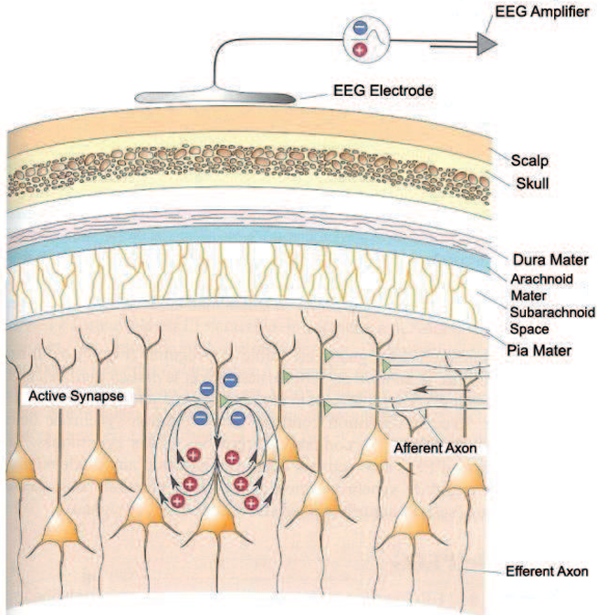

**Figura 1.** Generación de señales EEG a partir de dipolos eléctricos formados por neuronas piramidales alineadas. Tomado de [4].

## 🎯 2. Objetivos
---

### 🌟2.1 Objetivo general
---
- Comprender el proceso de adquisición y procesamiento de señales de electroencefalograma (EEG) mediante su aplicación en el análisis de la actividad cerebral bajo diferentes condiciones experimentales.

### 📌2.2 Objetivos específicos
---
- Adquirir señales biomédicas de electroencefalograma (EEG) de un sujeto bajo diferentes condiciones de estimulación visual y cognitiva: ojos cerrados, ojos abiertos y realización de tarea cognitiva.

- Configurar correctamente el módulo BITalino para EEG, asegurando el uso de los electrodos adecuados, la correcta colocación en el cuero cabelludo y una conexión estable durante la adquisición.

- Analizar las señales obtenidas mediante OpenSignals (r)evolution y técnicas de procesamiento en Python, incluyendo filtrado, cálculo de potencia por bandas (α, β, θ, δ, γ) y detección de eventos como parpadeos, con el fin de extraer conclusiones sobre la actividad cerebral en cada condición experimental.

## 🛠️ 3. Instrumentos
---

|             Ítem              |                  Descripción                    |              Cantidad            |
|----------------------------|------------------------------------------------|:----------------------------------:|
|  BiTalino (r)evolution   |     Módulo de adquisición de señales biomédicas, incluye entradas para señales ECG, EMG, EEG y EDA.     |   1  |
| Cable para 3 electrodos |  Conector tripolar para la conexión de electrodos y el módulo de adquisición.     | 1 |
| Batería recargable LIPO 3.7V - 500mA |     Fuente de energía portátil para el  módulo BiTalino (r)evolution.         | 1 |
| Electrodos de superficie |  Sensores descartables para el registro de señales biomédicas.  |  3  |
| Laptop |     Equipo utilizado para la obtención de señales con el software OpenSignals (r)evolution  y procesamiento con Python.    |  1  |
| Ultracortex Mark IV (dry-electrode headset) |     Caso EEG abierto y modular diseñado para registrar actividad cerebral en aplicaciones de neurociencia, BCI y neurotecnología DIY    |  1  |

|  |  |  |
|:---------:|:---------:|:---------:|
| **(a)** | **(b)** | **(c)** |

**Figura 2**. Materiales utilizados para la realización del experimento. De izquierda a derecha: (a) BiTalino (r)evolution con batería. (b) Laptop para adquisición de señales. (c) Ultracortex Mark IV.

## 🔍 4. Metodología
---

### 🧾 4.1 Marco teórico
---

#### 4.1.1 Generación de la señal EEG
---
La EEG de superficie mide diferencias de potencial producidas por corrientes postsinápticas de poblaciones de neuronas piramidales orientadas de forma coherente en corteza. La señal registrada es resultado de una suma espacial y temporal atenuada por conducción de volumen (hueso, LCR, piel). Esto implica una baja relación señal/ruido y alta sensibilidad a artefactos, por lo que se necesita preprocesamientos a las señales [3], [4].

#### 4.1.2 Bandas y reactividad alfa (EO vs EC)
Los ritmos clásicos incluyen δ (0.5–4 Hz), θ (4–8 Hz), **α (8–13 Hz)**, β (13–30 Hz) y γ (>30 Hz). En reposo con ojos cerrados, la potencia alfa aumenta de manera robusta, particularmente en regiones posteriores; al abrir los ojos o aumentar la carga atencional, esa potencia se suprime. Esta “reactividad alfa” se interpreta como un mecanismo de gating sensorial con modulación tálamo-cortical [3], [7].

  
| **Banda** | **Frecuencia (Hz)** | **Estado**                        |
|-----------|---------------------|-----------------------------------|
| δ         | 0.5 – 4             | Sueño profundo                    |
| θ         | 4 – 8               | Somnolencia, navegación espacial  |
| α         | 8 – 13              | Reposo, ojos cerrados             |
| β         | 13 – 30             | Atención, cálculo                 |
| γ         | > 30                | Procesamiento cognitivo rápido    |

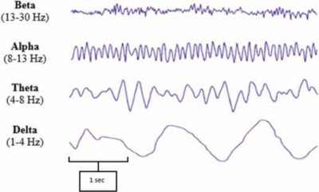

**Figura 3**. Forma de las bandas EEG. Tomado de [8].

#### 4.1.3 Sistema 10–20, Fp1/Fp2 y artefactos oculares
---
El **sistema 10–20** estandariza posiciones y facilita reproducibilidad. Fp1 (frontal polar izquierdo) y Fp2 (frontal polar derecho) están muy próximos a los ojos, por lo que captan con alta amplitud parpadeos y movimientos oculares (artefactos EOG) [9]. En frontal, los parpadeos pueden superar los 200 μV, afectando potencias por canal y pudiendo generar asimetrías aparentes entre Fp1/Fp2 si difieren el patrón de parpadeo, la impedancia o la referencia [9].

  
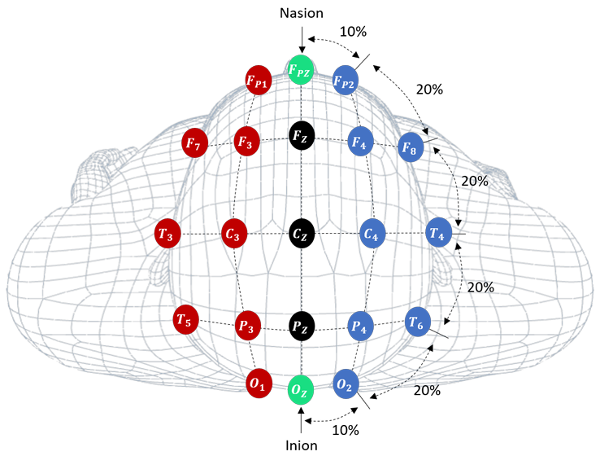

**Figura 4**. Vista superior de un cabezal con posicionamiento de electrodos según el sistema internacional 10-20. Tomado de [10].

#### 4.1.4 Electrodos: húmedos vs secos
---
- **Húmedos (Ag/AgCl + gel)**: estándar clínico por baja impedancia y estabilidad; requieren preparación de piel y limpieza posregistro [11].  
- **Secos (multi-pin, gel-free)**: despliegue rápido y reutilizable (útiles con cascos tipo Ultracortex); hoy muestran desempeño comparable en ciertas tareas si el diseño es adecuado, aunque pueden ser más sensibles a movimiento y contacto en registros pasivos [11].

#### 4.1.5 Muestreo, referencia y filtrado
---
- **Muestreo**: se elige una frecuencia de muestreo de 1000 Hz para cubrir con margen las bandas de interés y evitar aliasing.
- **Referencia**: mastoides (apófisis del hueso temporal de los mamíferos, situada detrás y debajo de la oreja).
- **Filtrado:**
  - **Pasabanda** típico **0.5–40/80 Hz** para conservar bandas fisiológicas y suprimir offset [7]. 
  - **Notch** a **50/60 Hz** para atenuar red eléctrica [7].  

  
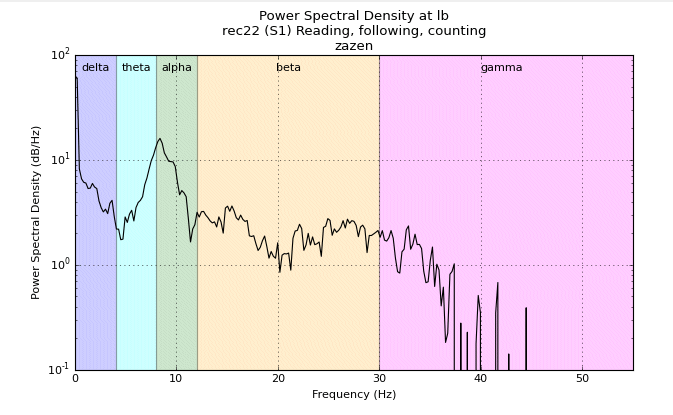

**Figura 5**. Densidad espectral de potencia para cada banda. Tomado de [12].

#### 4.1.6 Estimación espectral y métricas
---
Para cuantificar cambios EO/EC, se usa la **PSD por Welch** (ventanado Hanning, 50% de solape) y calcular potencia absoluta/relativa por banda. En este protocolo, la métrica primaria es potencia alfa (8–13 Hz) en EO vs EC por canal (Fp1, Fp2). Por otro lado, las métricas secundarias son el conteo de parpadeos y el cálculo de la potencia β durante tareas cognitivas [13].

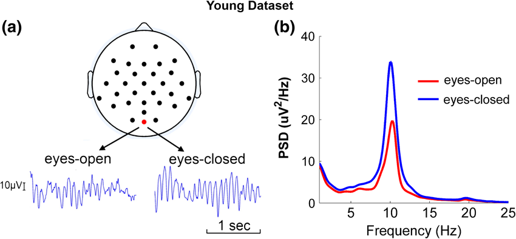

**Figura 6**. Oscilaciones alfa durante el estado de reposo de EC y EO en adultos jóvenes. (a) Trazos de EEG de un participante típico. (b) Espectros de potencia promediados entre los participantes. Tomado de [13].

### 📝 4.2 Procedimiento experimental
---
#### 4.2.1 Preparación de software y proyecto
---

1) Instalar OpenSignals (r)evolution y verificar su funcionamiento.
2) Emparejar BITalino con la laptop mediante Bluethoot.
3) Configurar el canal A4 como EEG y fijar **fs = 1000 Hz** (cumplimiento del criterio de Nyquist).
4) Crear una carpeta para guardar las señales en formato **.txt/.csv** exportados.

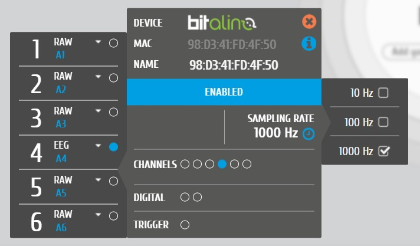

**Figura 7**. Configuración de adquisición en OpenSignals.

#### 4.2.2 Montaje de electrodos
---

6) Limpieza de piel en **Fp1, Fp2** y **mastoide derecha** (referencia).
7) Conectar: **Electrodo1 → Fp1**, **GND → Fp2**, **Electrodo2 → mastoide** (referencia).
8) Comprobar impedancia < 20 kΩ en OpenSignals.

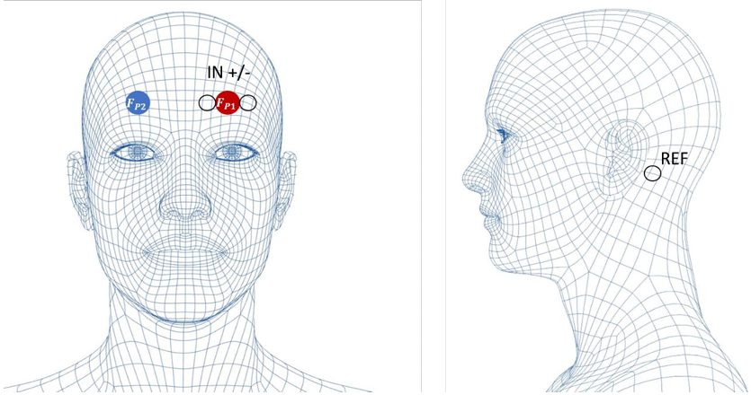

**Figura 8**. Posiciones 10-20 (Fp1/Fp2) y referencia. Tomado de [10].

> **Notas de seguridad / calidad**: operar **con batería** (no mientras carga) y evitar movimientos/gestos durante registro.

#### 4.2.3 Secuencia de registro
---

9) Ejecutar la siguiente cronología (grabar videos y  señales obtenidas):

| Min | Condición         | Indicaciones |
|-----|-------------------|--------------|
| 0–1 | **Basal 1 (EO)**  | Ojos abiertos, fijar un punto |
| 1–2 | **Basal 2 (EC)**  | Ojos cerrados, relajado |
| 2–4 | **Tarea cognitiva** | Restar 7 desde 100 en silencio (u opción del §4.4) |
| 4–6 | **Artefactos**    | Parpadear cada 2 s y masticar (para etiquetar EOG/EMG) |
| 6–12| **Libre**          | Diseño del grupo (música, respiración, etc.) |

  
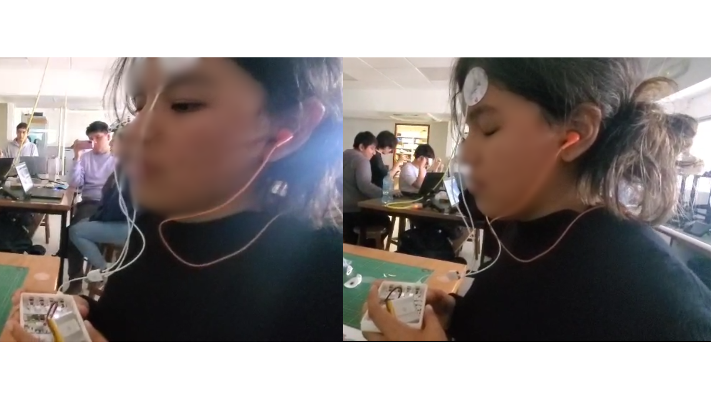
**Figura 9**. Posturas OE (ojos abiertos) y EC (ojos cerrados), respectivamente (de izquierda a derecha).

#### 4.2.4 Exportación y respaldo
---
10) Exportar cada segmento a **.csv** / **.txt** dentro de la carpeta creada.

#### 4.2.5 Preprocesamiento
---

11) El propio hardware de BiTalino cuenta con un filtro en el canal de EEG: pasabanda 0.8–48 Hz, suprime DC y 50/60 Hz (baseline noise).

#### 4.2.6 Análisis cuantitativo
---

13) PSD (Welch) por canal (Fp1, Fp2)
14) **Comparaciones principales**:  
   - EO vs EC en α (8–13 Hz)
   - Tarea cognitiva: verificar banda β (13–30 Hz) vs basal.
   - Fp1 vs Fp2: revisar asimetrías y asociarlas a EOG/contacto si aparecen.
15) Conteo de parpadeos (segmento artefactos): criterio > 80 µV para detección.
16) Repetir análisis en el canal O2 para observar modulación visual.

  
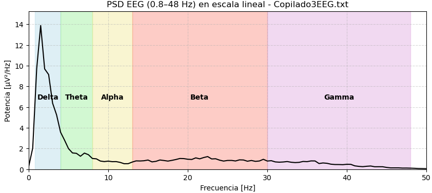

**Figura 10**. Ejemplo de PSD de la señal EEG.

  
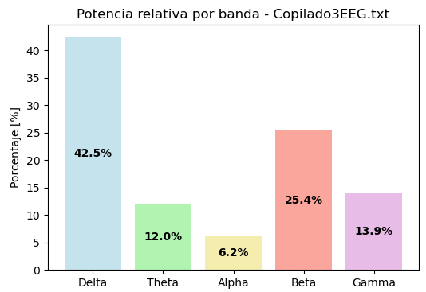

**Figura 11**. Ejemplo de potencia relativa por bandas de la señal EEG.

## 📉🔍 5. Resultados
---

### 🎥 5.1 Repositorio de vídeos
---
En esta sección encontrará todas las tomas de video de las señales utilizadas para el análisis requerido.

| Condición                      | Video 1 | Video 2 | Video 3 |
|:--------------------------------:|:---------:|:---------:|:---------:|
| Reposo y punto fijo                         | [▶️](https://youtu.be/DD4bQdDkeEA)     | [▶️](https://youtu.be/Sdjq2KTkGdA)       | [▶️](https://youtu.be/AzJA-2Yh17o)       |
| Acción 100 - 7  | [▶️](https://youtu.be/jsVCPEOsZHc)       |  -  |   -  |
| Pestañeo | [▶️](https://youtu.be/vqS_VKrlu9c)      |   [▶️](https://youtu.be/OsAC1tRgnOw)      |      [▶️](https://youtu.be/P1OlUgBQ5Cg)     |

### 📊 5.2 Gráficas obtenidas
---
#### 5.2.1 Señales EEG crudas y filtradas durante reposo (ojos cerrados) y fijación visual (ojos abiertos)
---

| Señal cruda | Señal filtrada |
|:-----------:|:--------------:|
| 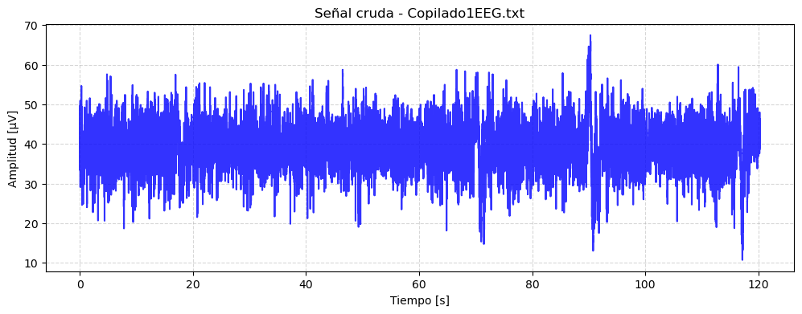 | 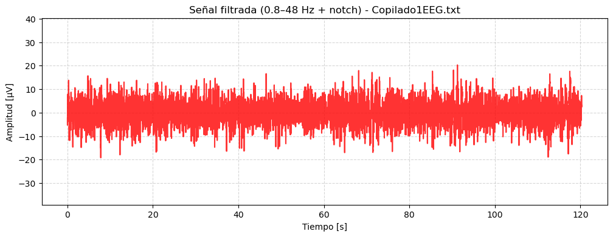 |
| 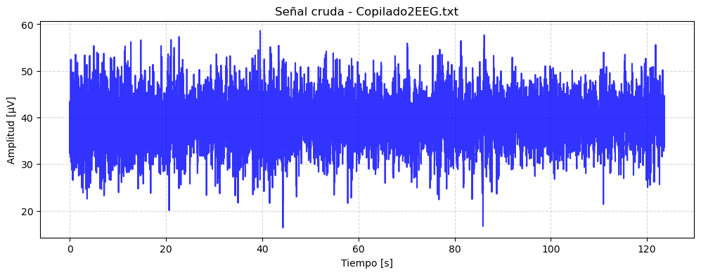 | 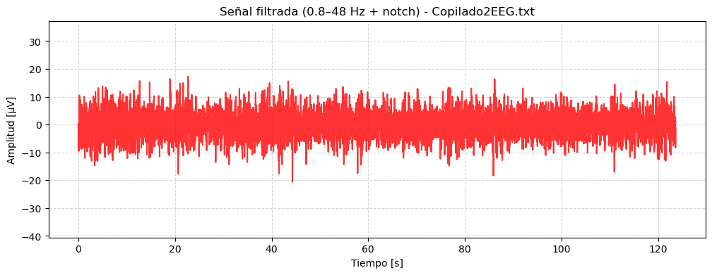 |
| 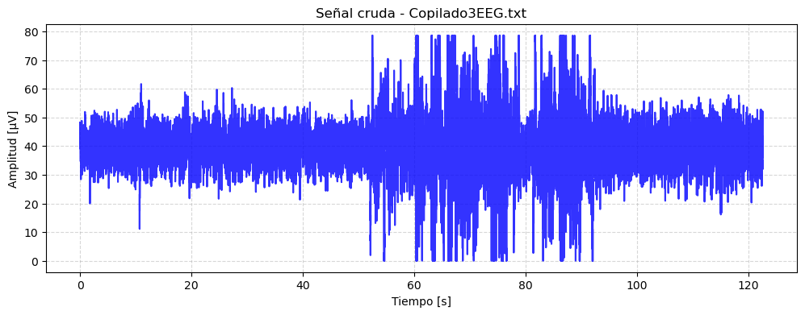 | 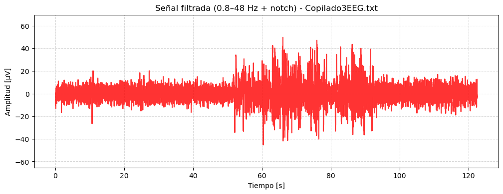 |

<b>Figura 12.</b> Señales EEG crudas y filtradas (0.8–48 Hz) durante reposo basal con ojos cerrados y fase de fijación visual con ojos abiertos. Panel izquierdo: señales crudas; panel derecho: señales filtradas.

#### 5.2.2 Densidad espectral de potencia (PSD) de EEG
---

| Grabación | PSD EEG |
|:---------:|:-------:|
| 1         | 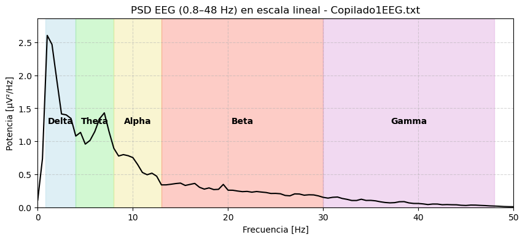 |
| 2         | 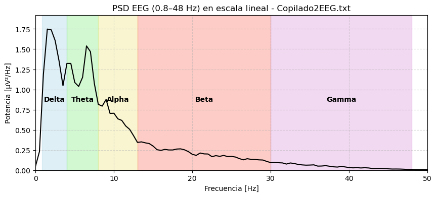 |
| 3         | 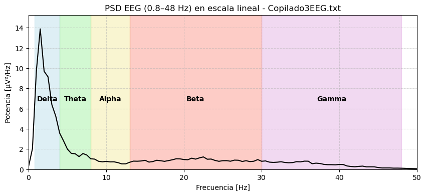 |

<b>Figura 13.</b> Densidad espectral de potencia (PSD) de EEG para cada grabación de referencia.

#### 5.2.3 Potencia relativa (%) por banda
---

| Grabación | Comparación α (Cerrados vs Abiertos) |
|:---------:|:-----------------------------------:|
| 1         | 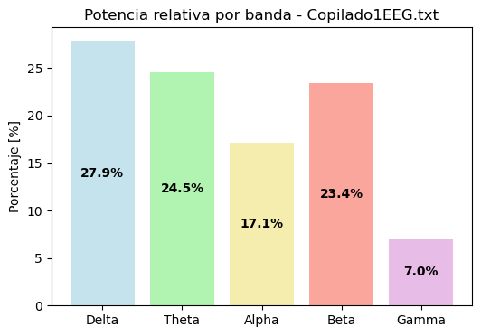 |
| 2         | 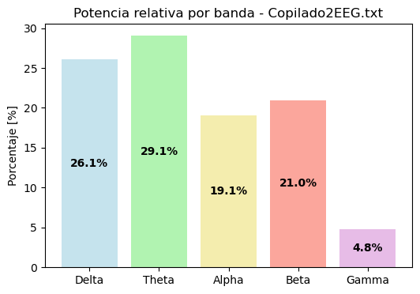 |
| 3         | 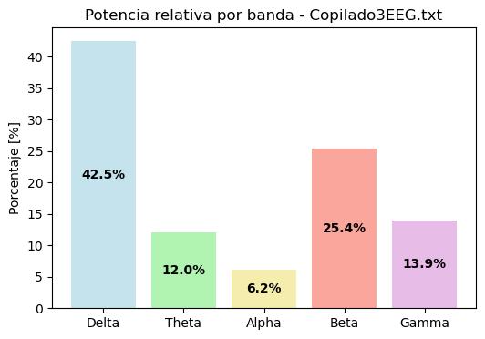 |

<b>Figura 14.</b> Potencia relativa (%) por banda (Δ, θ, α, β, γ) para cada grabación de referencia.

#### 5.2.4 Comparación de potencia α: ojos cerrados vs ojos abiertos
---

| Grabación | Comparación α (Cerrados vs Abiertos) |
|:---------:|:-----------------------------------:|
| 1         | 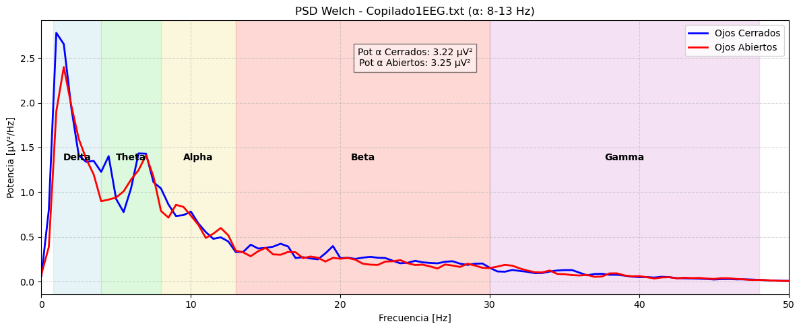 |
| 2         | 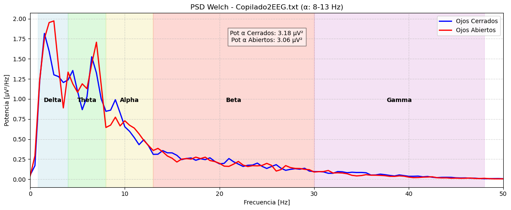 |
| 3         | 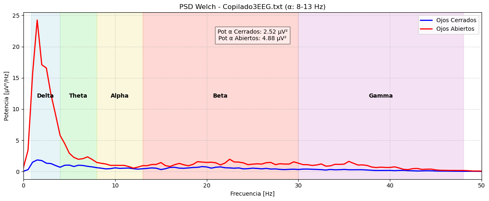 |

<b>Figura 15.</b> Comparación de potencia α (8–13 Hz) por ventanas de 2 s (PSD Welch) en cada grabación, mostrando diferencias entre ojos cerrados y ojos abiertos.

#### 5.2.5 Tarea cognitiva: Resta 100‑7
---

| Señal cruda | Señal filtrada |
|:-----------:|:-------------:|
| 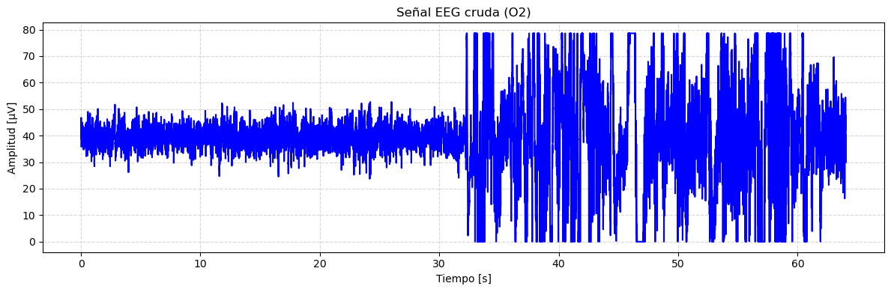 |  |

<b>Figura 16.</b> Señal EEG durante la tarea cognitiva (1 min), mostrando la actividad en banda β (13–30 Hz).

#### 5.2.6 Comparación de potencia β durante tarea cognitiva
---

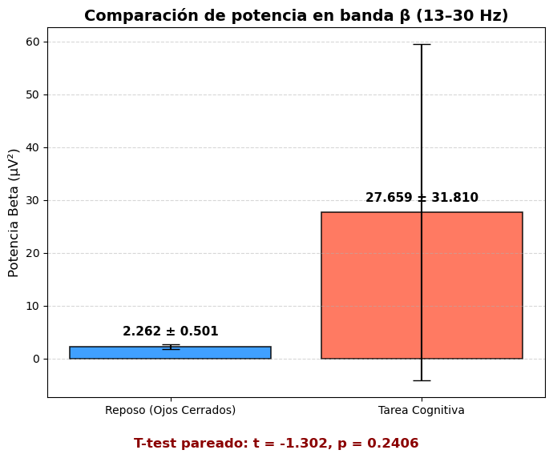

<b>Figura 17.</b> Comparación de potencia en banda β (13–30 Hz) entre reposo y tarea cognitiva (t-test pareado). Solo se utilizó una grabación para esta evaluación.

#### 5.2.7 Detección de parpadeos 
---

| Señal cruda                  | Señal filtrada                | Parpadeos detectados          |
|:----------------------------:|:----------------------------:|:----------------------------:|
| 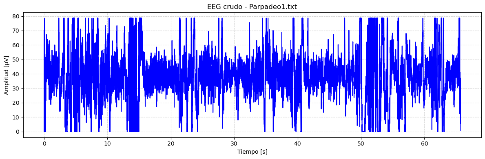 | 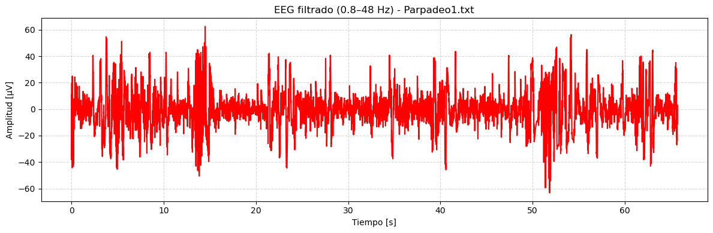 | 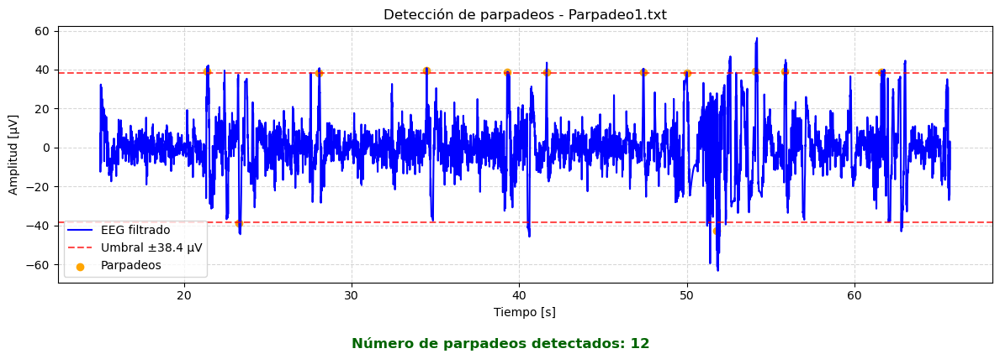 |
| 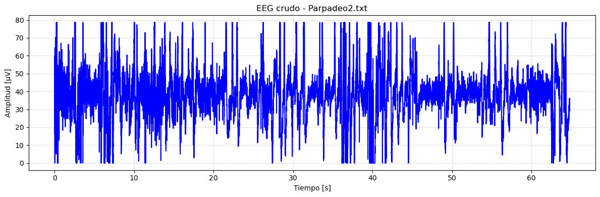 | 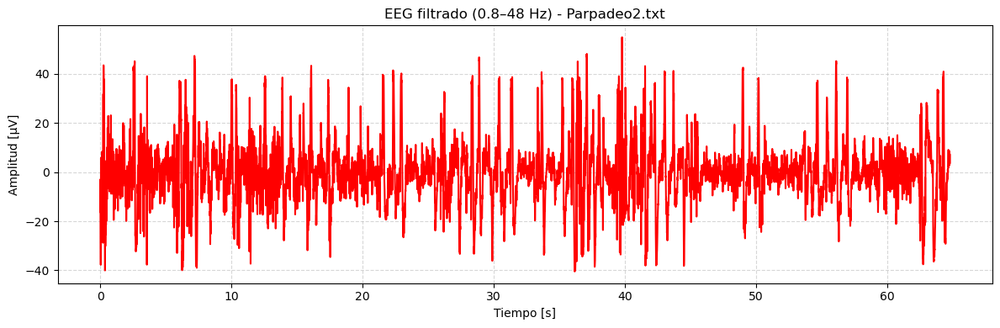 | 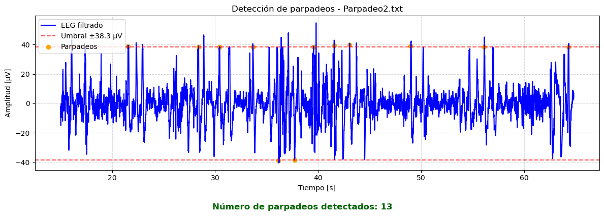 |
| 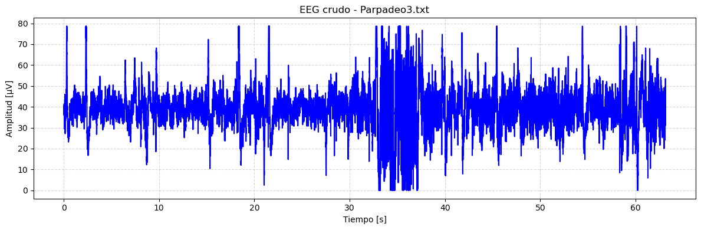 | 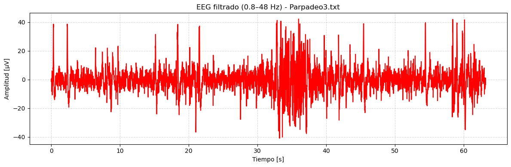 | 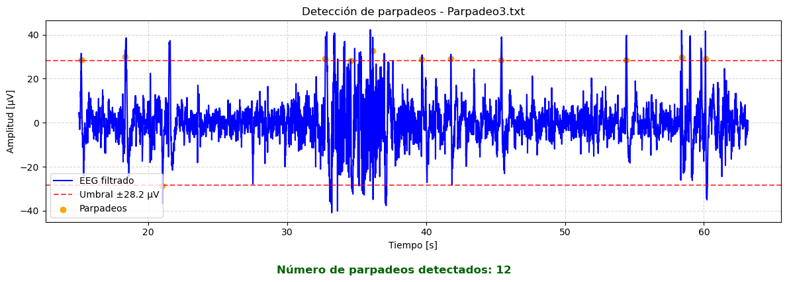 |

<b>Figura 18.</b> Señales filtradas con parpadeos detectados indicados con puntos naranjas y umbral adaptativo (líneas rojas).

#### 5.2.8 Actividad cognitiva libre: Escuchar música
---

| Señal cruda | Señal filtrada |
|:-----------:|:--------------:|
|  | 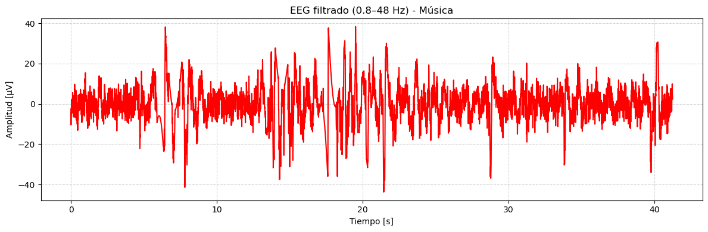 |

| PSD Welch | Potencia relativa por bandas |
|:-------------------:|:---------------------------:|
| 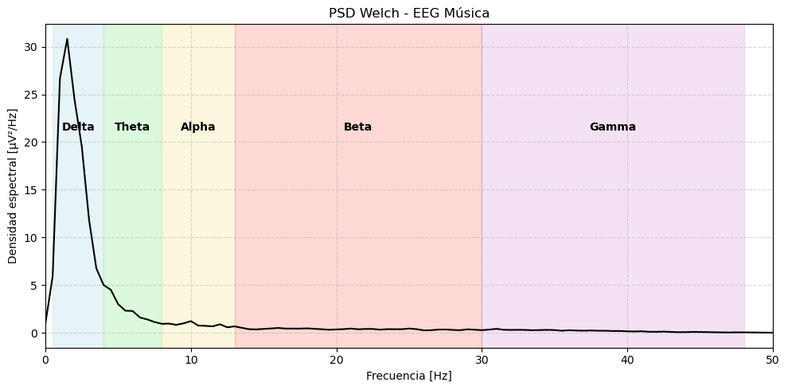 | 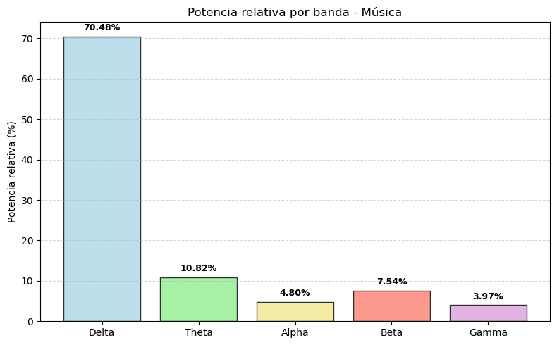 |

<b>Figura 19.</b> Señal cruda, señal filtrada, espectro PSD Welch y distribución de potencias relativas por banda durante la actividad cognitiva libre (escuchar música, 1 min).

## 💭📖 6. Discusión e interpretación
---
XD

## 📚 7. Referencias
---
[1] F. Torres, “Electroencephalography: Basic Principles, Clinical Applications and Related Fields,” Archives of Neurology, vol. 40, no. 3, pp. 191–192, 1983, doi: 10.1001/archneur.1983.04050030085025.

[2] T. Kirschstein and R. Köhling, “What is the source of the EEG?,” Clinical EEG and Neuroscience, vol. 40, no. 3, pp. 146–149, Jul. 2009, doi: 10.1177/155005940904000305. 

[3] G. Pfurtscheller and F. H. Lopes da Silva, “Event-related EEG/MEG synchronization and desynchronization: basic principles,” Clinical Neurophysiology, vol. 110, no. 11, pp. 1842–1857, Nov. 1999, doi: 10.1016/S1388-2457(99)00141-8. 

[4] EPFL Infoscience, “Repository record (handle: 20.500.14299/47157),” institutional repository entry, accessed Sep. 19, 2025. [Online]. Available: https://infoscience.epfl.ch/handle/20.500.14299/47157
 
[5] J. L. Moore, D. Z. Carvalho, E. K. St. Louis, and C. Bazil, “Sleep and Epilepsy: a Focused Review of Pathophysiology, Clinical Syndromes, Co-morbidities, and Therapy,” Neurotherapeutics, vol. 18, no. 1, pp. 170–180, 2021, doi: 10.1007/s13311-021-01021-w. 

[6] J. Zou et al., “Noninvasive closed-loop acoustic brain–computer interface for seizure control,” Theranostics, vol. 14, no. 15, pp. 5965–5981, 2024, doi: 10.7150/thno.99820. 

[7] A. Chaddad, Y. Wu, R. Kateb, and A. Bouridane, “Electroencephalography Signal Processing: A Comprehensive Review and Analysis of Methods and Techniques,” Sensors, vol. 23, no. 14, p. 6434, 2023, doi: 10.3390/s23146434. 

[8] Á. Marco, “El ritmo alfa del EEG: La ventana hacia nuestra inteligencia. El estado de flujo,” Clínica Marco Rived, Nov. 23, 2024. Accessed: Sep. 19, 2025. [Online]. Available: https://clinicamarcorived.com/el-ritmo-alfa-del-eeg-la-ventana-hacia-nuestra-inteligencia-el-estado-de-flujo/
 
[9] A. Egambaram, N. Badruddin, V. S. Asirvadam, T. Begum, E. Fauvet, and C. Stolz, “FastEMD–CCA algorithm for unsupervised and fast removal of eyeblink artifacts from electroencephalogram,” Biomedical Signal Processing and Control, vol. 57, art. 101692, 2020, doi: 10.1016/j.bspc.2019.101692. 

[10] PLUX – BITalino, Home Guide 3: EEG (Lab Guide), Apr. 2022. Accessed: Sep. 19, 2025. [Online]. Available: https://support.pluxbiosignals.com/wp-content/uploads/2022/04/HomeGuide3_EEG.pdf
 
[11] M. Zhang et al., “Recent Advances in Portable Dry Electrode EEG: Architecture and Applications in Brain–Computer Interfaces,” Sensors, vol. 25, no. 16, p. 5215, 2025, doi: 10.3390/s25165215. 

[12] “Characteristics of the alpha peak in EEG signals,” Still Breathing (blog), Jan. 27, 2016. Accessed: Sep. 19, 2025. [Online]. Available: https://still-breathing.net/characteristics-of-the-alpha-peak-in-eeg-signals/

[13] “Alpha oscillations during EC and EO resting state in young adults: EEG traces …,” ResearchGate, figure page, Accessed: Sep. 19, 2025. [Online]. Available: https://www.researchgate.net/figure/Alpha-oscillations-during-EC-and-EO-resting-state-in-young-adults-a-EEG-traces-of-a_fig1_327866942

[14] 

## 👥 Aporte de los integrantes
---

| Integrante      | Contribución (%) |
|-----------------|:------------------:|
| Salet Garcia    | 33.33%           |
| Dhiago Llanos   | 33.33%           |
| Rafael Panez    | 33.33%           |
