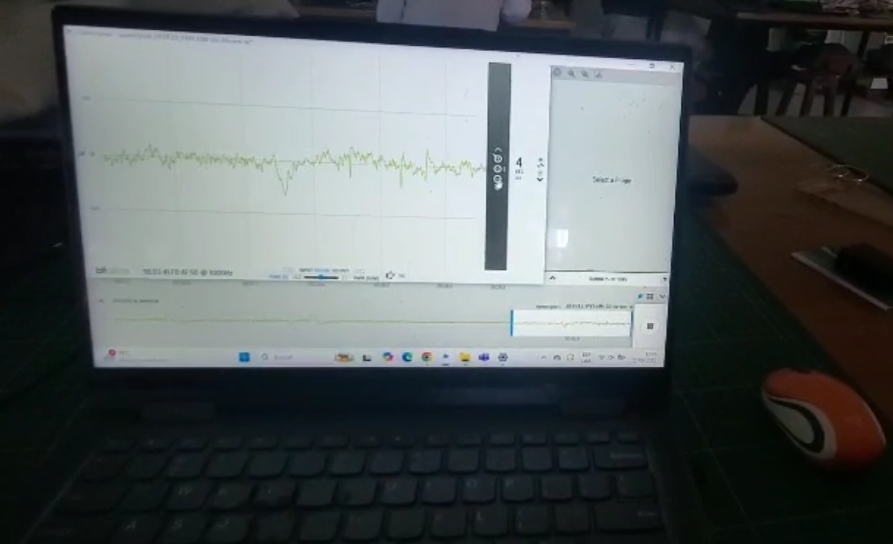

# LABORATORIO 5:  Uso de BiTalino para adquisición y análisis de señales EEG
---

## 1. Introducción

El electroencefalograma (EEG) es una técnica no invasiva que permite registrar la actividad eléctrica del cerebro mediante electrodos colocados en el cuero cabelludo [1]. Esta herramienta resulta fundamental en neurociencia y medicina clínica, ya que posibilita la evaluación de funciones cerebrales y el diagnóstico de distintos trastornos neurológicos [1]. Asimismo, el EEG facilita la monitorización continua de la actividad cerebral en pacientes críticos y la evaluación de la eficacia de tratamientos neurológicos, constituyéndose como un instrumento indispensable en investigación y entornos clínicos [2].

La generación de las señales EEG se produce principalmente en las neuronas piramidales de la corteza cerebral, ubicadas en las capas III y V [3], [4]. Estas neuronas presentan una orientación perpendicular a la superficie cortical, lo que permite la formación de dipolos eléctricos detectables en el cuero cabelludo. La actividad registrada corresponde a la suma de los potenciales postsinápticos excitatorios e inhibitorios de grandes grupos de neuronas activadas de manera sincronizada [3]. Las oscilaciones resultantes se organizan en ritmos de alfa (8–13 Hz), beta (13–30 Hz), theta (4–8 Hz) y delta (0.5–4 Hz), cada uno asociado a distintos estados de conciencia y funciones cognitivas [3].

En cuanto a sus aplicaciones, el EEG constituye una herramienta esencial para el diagnóstico de epilepsia y la localización precisa de focos epilépticos, así como para estudios de sueño orientados a identificar trastornos como la narcolepsia [5]. De igual manera, la integración del EEG con técnicas de aprendizaje automático ha permitido el desarrollo de interfaces cerebro-computadora (BCI), lo que posibilita la comunicación y el control de dispositivos por parte de personas con discapacidades motoras [6].

**Figura 1.** Generación de señales EEG a partir de dipolos eléctricos formados por neuronas piramidales alineadas. Tomado de [4].

---
## 2. Objetivos

### 2.1 Objetivo general
—
Comprender el proceso de adquisición y procesamiento de señales de electroencefalograma (EEG) mediante su aplicación en el análisis de la actividad cerebral bajo diferentes condiciones experimentales.

### 2.2 Objetivos específicos
XD

---
## 🛠️ 3. Instrumentos

|             Ítem              |                  Descripción                    |              Cantidad            |
|----------------------------|------------------------------------------------|:----------------------------------:|
|  BiTalino (r)evolution   |     Módulo de adquisición de señales biomédicas, incluye entradas para señales ECG, EMG, EEG y EDA.     |   1  |
| Cable para 3 electrodos |  Conector tripolar para la conexión de electrodos y el módulo de adquisición.     | 1 |
| Batería recargable LIPO 3.7V - 500mA |     Fuente de energía portátil para el  módulo BiTalino (r)evolution.         | 1 |
| Electrodos de superficie |  Sensores descartables para el registro de señales biomédicas.  |  3  |
| Laptop |     Equipo utilizado para la obtención de señales con el software OpenSignals (r)evolution  y procesamiento con Python.    |  1  |
| Ultracortex Mark IV (dry-electrode headset) |     Caso EEG abierto y modular diseñado para registrar actividad cerebral en aplicaciones de neurociencia, BCI y neurotecnología DIY    |  1  |

|  |  |  |
|:---------:|:---------:|:---------:|
| **(a)** | **(b)** | **(c)** |

**Figura 2**. Materiales utilizados para la realización del experimento. De izquierda a derecha: (a) BiTalino (r)evolution con batería. (b) Laptop para adquisición de señales. (c) Ultracortex Mark IV.

---
## 📝 4. Marco teórico

### 4.1 Marco teórico
#### 4.1.1 Generación de la señal EEG
La EEG de superficie mide diferencias de potencial producidas por corrientes postsinápticas de poblaciones de neuronas piramidales orientadas de forma coherente en corteza. La señal registrada es resultado de una suma espacial y temporal atenuada por conducción de volumen (hueso, LCR, piel). Esto implica una baja relación señal/ruido y alta sensibilidad a artefactos, por lo que se necesita preprocesamientos a las señales [3], [4].

#### 4.1.2 Bandas y reactividad alfa (EO vs EC)
Los ritmos clásicos incluyen δ (0.5–4 Hz), θ (4–8 Hz), **α (8–13 Hz)**, β (13–30 Hz) y γ (>30 Hz). En reposo con ojos cerrados, la potencia alfa aumenta de manera robusta, particularmente en regiones posteriores; al abrir los ojos o aumentar la carga atencional, esa potencia se suprime. Esta “reactividad alfa” se interpreta como un mecanismo de gating sensorial con modulación tálamo-cortical [3], [7].

  
| **Banda** | **Frecuencia (Hz)** | **Estado**                        |
|-----------|---------------------|-----------------------------------|
| δ         | 0.5 – 4             | Sueño profundo                    |
| θ         | 4 – 8               | Somnolencia, navegación espacial  |
| α         | 8 – 13              | Reposo, ojos cerrados             |
| β         | 13 – 30             | Atención, cálculo                 |
| γ         | > 30                | Procesamiento cognitivo rápido    |

**Figura 3**. Forma de las bandas EEG. Tomado de [8].

#### 4.1.3 Sistema 10–20, Fp1/Fp2 y artefactos oculares
El **sistema 10–20** estandariza posiciones y facilita reproducibilidad. Fp1 (frontal polar izquierdo) y Fp2 (frontal polar derecho) están muy próximos a los ojos, por lo que captan con alta amplitud parpadeos y movimientos oculares (artefactos EOG) [9]. En frontal, los parpadeos pueden superar los 200 μV, afectando potencias por canal y pudiendo generar asimetrías aparentes entre Fp1/Fp2 si difieren el patrón de parpadeo, la impedancia o la referencia [9].

  

**Figura 4**. Vista superior de un cabezal con posicionamiento de electrodos según el sistema internacional 10-20. Tomado de [10].

#### 4.1.4 Electrodos: húmedos vs secos
- **Húmedos (Ag/AgCl + gel)**: estándar clínico por baja impedancia y estabilidad; requieren preparación de piel y limpieza posregistro [11].  
- **Secos (multi-pin, gel-free)**: despliegue rápido y reutilizable (útiles con cascos tipo Ultracortex); hoy muestran desempeño comparable en ciertas tareas si el diseño es adecuado, aunque pueden ser más sensibles a movimiento y contacto en registros pasivos [11].

#### 4.1.5 Muestreo, referencia y filtrado
- **Muestreo**: se elige una frecuencia de muestreo de 1000 Hz para cubrir con margen las bandas de interés y evitar aliasing.
- **Referencia**: mastoides (apófisis del hueso temporal de los mamíferos, situada detrás y debajo de la oreja).
- **Filtrado:**
  - **Pasabanda** típico **0.5–40/80 Hz** para conservar bandas fisiológicas y suprimir offset [7]. 
  - **Notch** a **50/60 Hz** para atenuar red eléctrica [7].  

  

**Figura 5**. Densidad espectral de potencia para cada banda. Tomado de [12].

#### 4.1.6 Estimación espectral y métricas
Para cuantificar cambios EO/EC, se usa la **PSD por Welch** (ventanado Hanning, 50% de solape) y calcular potencia absoluta/relativa por banda. En este protocolo, la métrica primaria es potencia alfa (8–13 Hz) en EO vs EC por canal (Fp1, Fp2). Por otro lado, las métricas secundarias son el conteo de parpadeos y el cálculo de la potencia β durante tareas cognitivas [13].

**Figura 6**. Oscilaciones alfa durante el estado de reposo de EC y EO en adultos jóvenes. (a) Trazos de EEG de un participante típico. (b) Espectros de potencia promediados entre los participantes. Tomado de [13].

---
### 4.2 Procedimiento experimental
#### 4.2.1 Preparación de software y proyecto

1) **Instalar OpenSignals** (r)evolution y verificar que abre sin errores. :contentReference[oaicite:0]{index=0}  
2) **Emparejar BITalino** por Bluetooth (PIN **1234**). :contentReference[oaicite:1]{index=1}  
3) **Configurar el canal A4 como EEG** y fijar **fs = 1000 Hz** (cumple Nyquist para el filtro de 48 Hz del canal). :contentReference[oaicite:2]{index=2}  
4) Crear la estructura de carpetas: `Grupo_##/Sesion_EEG` para guardar **.txt/.csv** exportados. :contentReference[oaicite:3]{index=3}  
5) Verificar **batería > 30 %** antes de iniciar. :contentReference[oaicite:4]{index=4}

> **Inserta aquí** captura de tu **pantalla de OpenSignals** con A4=EEG y fs=1000 Hz.  
> `<!-- Figura 1: Configuración de adquisición en OpenSignals -->`

---

#### 4.2.2 Montaje de electrodos (≈5 min)

6) **Limpieza de piel** en **Fp1, Fp2** y **mastoide derecha** (referencia). :contentReference[oaicite:5]{index=5}  
7) Conectar: **Electrodo1 → Fp1**, **GND → Fp2**, **Electrodo2 → mastoide** (referencia). :contentReference[oaicite:6]{index=6}  
8) Comprobar **impedancia < 20 kΩ** en OpenSignals; reajustar contacto si es mayor. :contentReference[oaicite:7]{index=7}  

> **Inserta aquí** un esquema **10–20** con Fp1/Fp2 y referencia en mastoide.  
> `<!-- Figura 2: Posiciones 10–20 (Fp1/Fp2) y referencia -->`

> **Notas de seguridad / calidad**: operar **con batería** (no mientras carga) y evitar movimientos/gestos durante registro; documentar artefactos en cuaderno/vídeo. :contentReference[oaicite:8]{index=8}

---

#### 4.2.3 Secuencia de registro (≈12 min)

9) Ejecutar la siguiente **cronología** (marcar eventos/segmentos en el software):

| Min | Condición         | Indicaciones |
|-----|-------------------|--------------|
| 0–1 | **Basal 1 (EO)**  | Ojos abiertos, fijar un punto. :contentReference[oaicite:9]{index=9} |
| 1–2 | **Basal 2 (EC)**  | Ojos cerrados, relajado. :contentReference[oaicite:10]{index=10} |
| 2–4 | **Tarea cognitiva** | Restar 7 desde 100 en silencio (u opción del §4.4). :contentReference[oaicite:11]{index=11} |
| 4–6 | **Artefactos**    | Parpadear cada 2 s y masticar (para etiquetar EOG/EMG). :contentReference[oaicite:12]{index=12} |
| 6–12| **Libre**          | Diseño del grupo (música, respiración, etc.). :contentReference[oaicite:13]{index=13} |

> **Inserta aquí** fotos del **sujeto** en EO y EC (misma postura/iluminación).  
> `<!-- Fig. 3: Posturas EO y EC -->`

---

#### 4.2.4 Exportación y respaldo

10) Exportar cada segmento a **.csv** / **.txt** dentro de `Grupo_##/Sesion_EEG`, con nombres consistentes:  
`EO_01.csv`, `EC_01.csv`, `Tarea_01.csv`, `Artefactos_01.csv`, `Libre_01.csv`. :contentReference[oaicite:14]{index=14}

---

#### 4.2.5 Preprocesamiento mínimo (alineado a hardware)

11) Recordatorio de **filtro hardware** del canal EEG de BITalino: **pasabanda 0.8–48 Hz**, suprime **DC** y **50/60 Hz** (ruido de red). :contentReference[oaicite:15]{index=15}  
12) Aun así, **inspeccionar** y **marcar** artefactos (parpadeos > 80 µV, masticación) antes del análisis cuantitativo. :contentReference[oaicite:16]{index=16}

> **Inserta aquí** un diagrama simple del **pipeline**: crudo → inspección → (filtro HW ya aplicado) → segmentación → PSD.  
> `<!-- Fig. 4: Pipeline de preprocesamiento y análisis -->`

---

#### 4.2.6 Análisis cuantitativo (resumen operativo)

13) **PSD (Welch)** por canal (**Fp1**, **Fp2**): ventana ~2 s, solape 50 %. :contentReference[oaicite:17]{index=17}  
14) **Comparaciones principales**:  
   - **EO vs EC** en **α (8–13 Hz)**: se espera ↑α en EC. :contentReference[oaicite:18]{index=18} :contentReference[oaicite:19]{index=19}  
   - **Tarea cognitiva**: verificar **↑β (13–30 Hz)** vs basal. :contentReference[oaicite:20]{index=20} :contentReference[oaicite:21]{index=21}  
   - **Fp1 vs Fp2**: revisar asimetrías y asociarlas a EOG/contacto si aparecen. :contentReference[oaicite:22]{index=22}  
15) **Conteo de parpadeos** (segmento artefactos): criterio > **80 µV** para detección. :contentReference[oaicite:23]{index=23}  
16) (Opcional) Repetir análisis en **O2** para observar modulación visual. :contentReference[oaicite:24]{index=24}

> **Inserta aquí**:  
> `<!-- Fig. 5: PSD Fp1/Fp2 (EO vs EC) -->`  
> `<!-- Fig. 6: Barras de potencia α por condición y canal -->`

---

#### 4.2.7 Cierre y entregables

17) Guardar scripts/datos/figuras en el repositorio y redactar el **informe** con: **introducción, métodos, resultados, discusión y referencias** (según rúbrica). :contentReference[oaicite:25]{index=25} :contentReference[oaicite:26]{index=26}

> **Checklist rápido**  
> - A4=EEG, **fs=1000 Hz**, batería >30 % ✔︎ :contentReference[oaicite:27]{index=27}  
> - Fp1 (activo), **Fp2 (GND)**, mastoide (ref), **Z < 20 kΩ** ✔︎ :contentReference[oaicite:28]{index=28}  
> - Secuencia EO/EC/tarea/artefactos/libre **completada** ✔︎ :contentReference[oaicite:29]{index=29}  
> - PSD (Welch 2 s), α y β **calculadas**; parpadeos **contados** ✔︎ :contentReference[oaicite:30]{index=30}
## 6. Referencias
[1] https://jamanetwork.com/journals/jamaneurology/article-abstract/581666 

[2] https://pubmed.ncbi.nlm.nih.gov/19715175/

[3] https://pubmed.ncbi.nlm.nih.gov/10576479/ 

[4] https://publications.idiap.ch/downloads/reports/2007/uldry-idiap-com-07-04.pdf 

[5] https://www.neurotherapeuticsjournal.org/article/S1878-7479(23)01188-1/fulltext 

[6] https://pubmed.ncbi.nlm.nih.gov/39346532/ 

[7] https://doi.org/10.3390/s23146434

[8] https://clinicamarcorived.com/el-ritmo-alfa-del-eeg-la-ventana-hacia-nuestra-inteligencia-el-estado-de-flujo/

[9] https://doi.org/10.1016/j.bspc.2019.101692

[10] https://support.pluxbiosignals.com/wp-content/uploads/2022/04/HomeGuide3_EEG.pdf

[11] https://doi.org/10.3390/s25165215

[12] https://still-breathing.net/characteristics-of-the-alpha-peak-in-eeg-signals/

[13] https://www.researchgate.net/figure/Alpha-oscillations-during-EC-and-EO-resting-state-in-young-adults-a-EEG-traces-of-a_fig1_327866942

