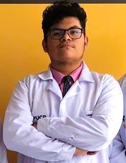

  

# 📊 Repositorio del Grupo 1 – ISB 2025-2
## 📝 Introducción
¡Bienvenidos al repositorio oficial del Grupo 1 del curso Introducción a Señales Biomédicas 2025-II!
En este espacio documentaremos nuestro proyecto, con la intención de reflejar nuestro aprendizaje a lo largo del curso. Aquí encontrarán toda la documentación, códigos, reportes y avances del proyecto, organizados de manera clara y estructurada.
## 👥 Integrantes del Equipo
| Foto |       Presentación          |
|-------------|-------------|  
| 

 |<strong>Dhiago Gustavo Llanos Florian</strong> <a href="mailto:dhiago.llanos@upch.pe" style="text-decoration: underline; color: #0366d6;">dhiago.llanos@upch.pe</a> “No necesito un nombre; puedo ser feliz sin él. Al fin y al cabo, no soy más que otro ingeniero biomédico anónimo. El muchacho innovador se encuentra cerca del egreso, y aunque al fin había encontrado un nombre, ya no quedaba nadie que pudiera oírlo y llamarlo. Aun así, Dhiago Llanos era un nombre demasiado hermoso para perderse en el silencio.”.|  
| 

  | <strong>Salet Carelis Garcia Reyes</strong> <a href="mailto:salet.garcia@upch.pe" style="text-decoration: underline; color: #0366d6;">salet.garcia@upch.pe</a> ¡Hola! Soy Salet Garcia, estudiante de Ingeniería Biomédica. Espero poder aprender más acerca de la obtención y uso de las señales biomédicas, así como su correcta interpretación. Asimismo, busco conocer su aplicación en la industria de dispositivos médicos e inteligencia artificial. |
| 

  | <strong>Rafael Alonso Panez Cuizano</strong> <a href="mailto:rafael.panez@upch.pe" style="text-decoration: underline; color: #0366d6;">rafael.panez@upch.pe</a> Soy Rafael Panez, estudiante de la carrera Ingeniería Biomédica. En este curso espero profundizar en el estudio de las señales biomédicas, aprendiendo técnicas de adquisición, filtrado, análisis y procesamiento de señales, y adquirir conocimientos prácticos que puedan aplicarse en el diseño y desarrollo de soluciones tecnológicas en salud |  
## 👨‍🏫 Profesores del curso
- Moises Stevend Meza Rodriguez
- Jose Alonso Caceres del Aguila
- Umbert Lewis de la Cruz Rodriguez
